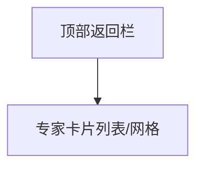

# 专家墙 页面设计

## 版本记录
| 日期 | 版本 | 修改内容 | 作者 |
|---|---|---|---|
| 2026-01-12 | v1.0 | 初始设计 | View-Forge |

## 1. 页面概述
- **用户目标**：浏览并筛选平台内的专家/志愿者，了解其专业背景，便于选择合适的帮手。
- **关键操作**：筛选专家、浏览专家卡片、点击查看详细档案。

## 2. 视觉布局
- **整体结构**：页面采用顶部返回栏+内容区布局。顶部为带返回按钮的Header，内容区为专家/志愿者卡片的网格或列表展示。
- **间距与层次**：Header与内容区有明显分隔，卡片间距均匀，整体布局紧凑但不拥挤，卡片间有柔和阴影和圆角，提升视觉层次。

- **布局参数**：
    - Header高度适中，左侧为返回箭头，居中为页面标题“专家墙”。
    - 内容区宽度自适应，卡片排列为单列（移动端）或多列（PC），卡片间距适中。
    - 卡片视觉重心突出头像与姓名，信息分组清晰。

## 3. 组件细节
### 3.1 顶部返回栏 (Header)
- **组件名**：[Header]
- **相对尺寸与位置**：固定于页面顶部，宽度100%，高度适中，左侧为返回按钮，居中为标题。
- **样式细节**：背景色为云雾灰（#F4F6F8），无阴影，底部分隔线极弱化。
- **内容规范**：标题采用大号字重，主文本色（#2C3E50），左侧返回按钮为静谧蓝（#4A90E2）图标。
- **状态样式**：返回按钮悬停/按下时色彩加深，点击有轻微缩放反馈。

### 3.2 筛选器 (可选)
- **组件名**：[FilterBar]
- **相对尺寸与位置**：位于Header下方，宽度与内容区一致，紧贴顶部。
- **样式细节**：背景透明或弱化，筛选项为圆角按钮，主色/辅助色区分选中与未选中。
- **内容规范**：字体中等，选中项主色填充，未选中项边框主色描边。
- **状态样式**：按钮悬停/点击时色彩加深，选中有轻微阴影。

### 3.3 专家卡片列表/网格
- **组件名**：[ExpertCardList]
- **相对尺寸与位置**：内容区主区域，卡片纵向排列（移动端单列，PC多列自适应）。
- **样式细节**：卡片背景白色，圆角大，阴影柔和。卡片间距均匀，整体呼吸感强。
- **内容规范**：
    - 头像：居左或居中，圆形，尺寸相对较大。
    - 姓名：主文本色，字号突出。
    - 专业标签/身份：辅助色块点缀，标签圆角，色彩区分不同身份（如专家/志愿者）。
    - 简要介绍：正文色，字重适中，最多2行溢出省略。
    - 联系方式：脱敏展示（如“手机号：138****8888”），字体较小。
- **状态样式**：
    - 卡片悬停（PC）：整体阴影加深，头像微微上浮。
    - 卡片点击：背景色轻微变化，进入详情页。

### 3.4 空状态/加载态
- **组件名**：[EmptyState] / [Loading]
- **相对尺寸与位置**：内容区居中。
- **样式细节**：空状态用柔和插画或图标，主色/辅助色点缀，提示文案居中。
- **内容规范**：提示语温和简洁，如“暂无专家，敬请期待”。
- **状态样式**：加载时用主色系Loading动画，整体不影响页面美观。

## 4. 交互说明
- **页面跳转**：点击返回按钮返回上一级，点击专家卡片进入专家档案详情页。
- **筛选交互**：点击筛选项实时切换专家列表，选中项主色高亮。
- **加载与空态**：数据加载时展示Loading动画，加载失败时展示错误提示及重试按钮。
- **卡片反馈**：卡片悬停/点击有明显视觉反馈，提升操作愉悦感。

## 5. 适配与响应式
- **Mobile H5**：单列纵向滚动，卡片宽度自适应屏幕，筛选器为横向滑动。
- **PC Web**：多列网格布局，卡片间距适度增大，悬停反馈更丰富，筛选器可展开为侧边栏。
- **WeChat Mini Program**：遵循小程序原生导航栏，卡片风格贴合平台，筛选器为顶部横向滑动，避免复杂浮层。

