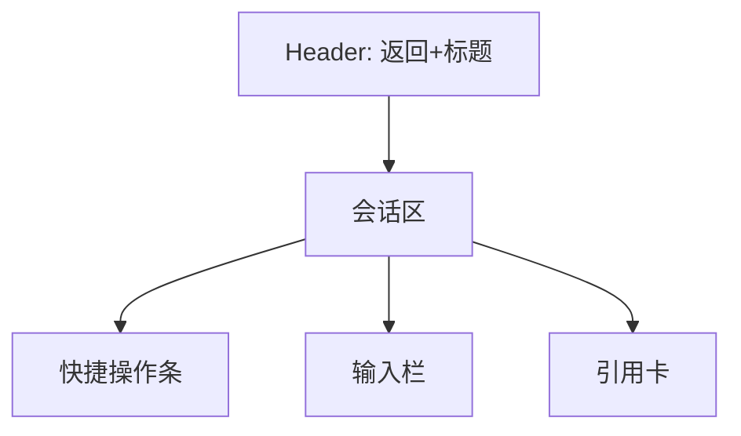

# 智能体咨询 页面设计

## 版本记录
| 日期 | 版本 | 修改内容 | 作者 |
|---|---|---|---|
| 2026-01-11 | v1.0 | 初始设计：智能体咨询页面视觉与交互规范 | View-Forge |
| 2026-01-12 | v1.1 | 融合新版前端界面设计方案，补充响应式、无障碍、异常态与交互细节 | View-Forge |

## 1. 页面概述
- **用户目标**：以沉浸式对话形式向智能体（AI）咨询心理/康复相关问题，获取分步建议，必要时可一键转人工。页面需最大程度降低认知负荷，强化权威感与安全感，适配情绪敏感用户。
- **关键操作**：
  1. 发起新对话 / 继续历史会话。
  2. 查看/展开 AI 消息引用卡，跳转知识详情。
  3. 一键转人工（发起工单），并带上下文摘要。

## 2. 视觉布局
- **目标前端类型**：Mobile H5 优先，兼容 PC Web、WeChat Mini Program。
- **整体结构**：

- **布局参数**：
  - Mobile：单列流式，容器宽度 100%，左右内边距 16px。
  - PC Web：主内容区居中，max-width 1200px，主会话列宽 720–900px，左右内边距 24px。
  - 层次关系：Header 固定顶部，InputBar 固定底部，会话区自适应填充。
  - 区块间距：区块间距 12–20px，消息项间距 8–12px。
  - 视觉重心：会话区为主，引用卡与快捷操作为辅助，底部输入区突出。

## 3. 组件细节（从上到下、从左到右）

### 3.1 头部区域（Header）
- **组件名**：头部栏 [Header]
- **相对尺寸与位置**：固定顶部，宽度始终占满主内容区，高度相对较高（约为顶部区域的 1/8），左右内边距充足，适配不同屏幕。
- **样式细节**：背景色纯白，底部分割线弱化，回退按钮圆角大、触控目标充足，主色 hover/active 态明显。
- **内容规范**：左侧回退 `<` 图标，居中标题“智能体咨询”，右侧可选“转人工”按钮（主色填充，圆角，图标点缀）。
- **状态样式**：回退按钮悬停/按下时背景淡灰，禁用时透明度降低。

### 3.2 会话主体（Conversation Area）
- **组件名**：会话流 [Message List]
- **相对尺寸与位置**：Header 下方自适应填充，底部与输入区间距适中，消息流纵向排列。会话区高度始终填满主内容区剩余空间，支持自然滚动。
- **样式细节**：背景色承接页面底色（云雾灰），消息项间距适中，滚动自然。
- **内容规范**：
  - **AI 气泡**：宽度相对较大（约为主内容区的 4/5），白底、主文本色、圆角大，边框淡蓝，轻微阴影，加载态有主色 spinner。
  - **用户气泡**：宽度相对较小（约为主内容区的 3/5），主色底、白字、右对齐，圆角更大，右下角更圆，突出方向感。
  - **时间/元信息**：小号灰色文字，气泡下方有适度间距。
  - **异常/错误气泡**：暖阳橙背景，主色/橙色文字，圆角，带重试按钮。

### 3.3 引用来源卡（Reference / Citation Card）
- **组件名**：引用卡 [Reference Card]
- **相对尺寸与位置**：嵌入 AI 气泡下方，宽度与气泡一致或略窄，左右留白。引用卡高度自适应内容，整体视觉上略小于消息气泡。
- **样式细节**：白底偏蓝，左侧主色强调条，圆角大，边框淡蓝，内容分区清晰。
- **内容规范**：标题加粗，摘要最多三行省略，来源标签用疗愈绿，整体视觉层次分明。
- **状态样式**：悬停/点击有轻微阴影，展开时渐入动画。

### 3.4 快捷操作（Quick Actions）
- **组件名**：快捷操作条 [Quick Actions]
- **相对尺寸与位置**：会话区下方或输入区上方，横向滚动，pill 间距适中。每个 pill 占据操作条宽度的 1/4~1/6，整体高度适中。
- **样式细节**：白底，主色描边，圆角 pill，主色文字，hover/active 态主色填充白字。
- **内容规范**：常用模板/快捷短语，字体适中，icon 点缀提升美观。

### 3.5 输入区（Input Bar）
- **组件名**：输入栏 [Composer]
- **相对尺寸与位置**：固定底部，宽度始终占满主内容区，高度相对适中（约为底部区域的 1/8），输入区与发送按钮分区明显。输入框高度随内容自适应，整体高度不超过底部区域的 1/4。
- **样式细节**：白底，顶部细分割线，输入框圆角大，主色边框聚焦，阴影提升层次。
- **内容规范**：多行自适应输入，最大 4 行，附件/语音按钮触控目标充足，发送按钮主色填充，禁用态灰色。
- **状态样式**：聚焦时主色描边，阴影扩散，发送按钮 hover/active 态主色加深。

## 4. 交互说明
- **页面跳转**：
  - 回退按钮默认 history.back()，无历史栈时跳转首页。
  - “转人工”弹窗确认后跳转 `/my/tickets/create`，附带会话摘要。
- **消息流**：新消息自动滚动到底部，用户上滑时显示“新消息”浮动按钮。
- **加载与异常**：AI 回复时显示骨架与主色 spinner，超时提示“继续生成”与中断选项。错误气泡突出暖阳橙，带重试。
- **引用卡交互**：点击引用卡弹出底部抽屉（Mobile）或侧滑（PC），展示全文/来源详情。
- **输入区适配**：Mobile 下键盘弹起时 InputBar 随视口调整，确保输入框与最新消息可见。
- **快捷操作**：点击 pill 自动补全输入区，支持左右滑动。

## 5. 适配与响应式
- **Mobile H5（默认）**：单列流式布局，输入区固定底部，引用详情用底部抽屉，主要间距 12–16px，触控目标充足。
- **PC Web**：主内容区居中，max-width 1200px，会话区两侧可扩展侧栏，引用详情用侧滑，悬停态补充复制/收藏等操作。
- **WeChat Mini Program**：页面栈跳转，引用详情新页面，避免复杂浮层，安全区适配。
- **无障碍与可访问性**：
  - 文本对比度满足 AA，主色文本不足时自动切白。
  - 触控目标最小 44x44，键盘导航支持 focus 环路。
  - 语义化标签与 aria-labels，辅助技术友好。

## 6. 异常态与空态设计
- **空态（首次进入）**：会话区居中展示欢迎卡片，主色 Logo 图标点缀，引导语“向智能体提问，或选择下面的模板开始”，下方 3 个主色 pill 快捷模板。欢迎卡片宽度约为主内容区的 2/3，高度约为主内容区的 1/3，整体居中。
- **错误态**：网络/生成失败时，消息区插入暖阳橙背景提示卡，主色/橙色文字，带“重试”按钮。

## 7. 交付与后续建议
- 建议前端开发严格映射设计变量（色彩、间距、字体）为 CSS tokens。
- InputBar 固定底部并监听 viewport resize。
- 引用卡与知识详情通过链接 `/knowledge/:id` 实现深链。
- “转人工”需后端附带会话摘要（200-500 字）。
