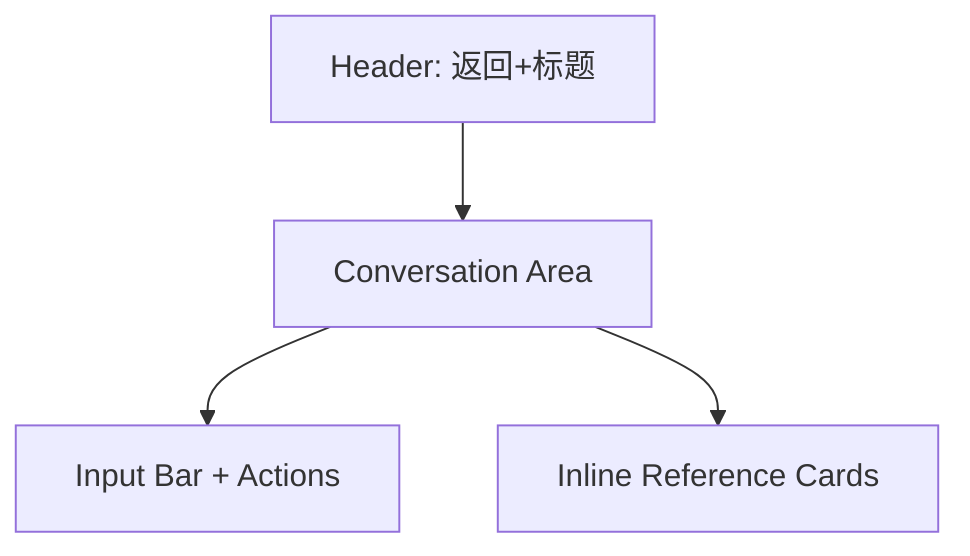

# 智能体咨询 页面设计

## 版本记录
| 日期 | 版本 | 修改内容 | 作者 |
|---|---|---|---|
| 2026-01-11 | v1.0 | 初始设计：智能体咨询页面视觉与交互规范 | View-Forge |

## 1. 页面概述
- **用户目标**：以沉浸式对话形式向智能体（AI）咨询心理/康复相关问题，获取分步建议，并在必要时发起人工工单。页面应降低认知负荷、提供可靠引用来源、并保证在情绪敏感用户下的舒适体验。
- **关键操作**：
  - 发起新对话 / 继续会话。
  - 查看消息来源引用卡并展开详情。
  - 在 AI 无法解决时“一键转人工/发起工单”。

## 2. 视觉布局
- **目标前端类型**：Mobile H5 优先（单栏流式），兼容 PC Web（容器最大宽度 1200px）。
- **整体结构（宏观）**：

- **容器与栅格**：
  - 基础宽度（Mobile）：容器宽度 = 100%（左右内边距 16px）。
  - 桌面（>=1024px）：居中容器，max-width: 1200px；左右内边距 24px；主内容列宽度 720–900px（居中）。
  - 栅格：单列流式（Mobile），PC 可在侧边显示会话统计或资源卡（非必要）。

- **全局间距**：
  - 页面外边距（Page Padding）Mobile: 16px；Tablet/Desktop: 24px。
  - 区块间距（Section Gap）: 12–20px（Mobile 使用较小值）。

- **配色与排版（来自设计方案）**：
  - 主色 Primary: `#4A90E2`（用于关键按钮、用户气泡背景）
  - 背景 Background: `#F4F6F8`（页面底色）
  - 文本主色 Text: `#2C3E50`（主文本）
  - 辅助色 Success: `#50E3C2`，强调 Accent: `#F5A623`。
  - 标题 Typography: 18px / 600；正文 Body: 16px / 400；辅助 Caption: 12px / 400。

## 3. 组件细节（从上到下）

### 3.1 头部区域（Header）
- **组件名**：头部栏 [Header]
- **尺寸与位置**：高度 56px，固定在顶部（次级页面标准）；左右内间距 16px。
- **样式细节**：背景色 `#FFFFFF`，底部阴影/分割线 `1px solid #E5E7EB`。
- **内容规范**：左侧回退图标（44x44 触控区域），中间标题文本 `智能体咨询`（18px/600，颜色 `#2C3E50`），右侧可选快捷操作（如“转人工”按钮）最小触控目标 44x44。
- **状态样式**：回退按钮有按下态（背景淡灰 #EEF2F5），不可用态降低不透明度至 40%。

### 3.2 会话主体（Conversation Area）
- **组件名**：会话流 [Message List]
- **尺寸与位置**：在 Header 下方可伸缩区域，顶部与底部间距 12px，消息列表上下内边距 8px，默认最大高度为屏高减去 Header 与 InputBar 的高度，支持自然滚动（overflow-y:auto）。
- **样式细节（整体）**：背景色透明（承接页面背景 `#F4F6F8`），消息项之间垂直间距 8–12px。

- **消息气泡：AI（系统）**
  - 背景：`#FFFFFF`
  - 文本色：`#2C3E50`
  - 字体：16px/400
  - 最大宽度：84% 容器宽（Mobile），圆角 12px
  - 边框/阴影：`1px solid #E6E9EE`，轻微阴影 `0 1px 2px rgba(16,24,40,0.04)`
  - 内边距：12px 14px
  - 状态：加载中显示占位骨架（高度按内容近似），加载 spinner 使用主色 `#4A90E2`。

- **消息气泡：用户（我）**
  - 背景：主色 `#4A90E2`
  - 文本色：`#FFFFFF`
  - 字体：16px/500
  - 最大宽度：72% 容器宽
  - 圆角：12px（右下角可更圆以示方向感）
  - 内边距：12px 14px

- **时间/元信息**：每条消息下方小字号 12px/400，颜色 `#6B7280`，与消息保持 6px 间距。

### 3.3 引用来源卡（Reference / Citation Card）
- **组件名**：引用卡 [Reference Card]
- **用途**：在 AI 回答中嵌入来源摘要（标题 + 来源机构 + 摘要片段 + 查看详情/跳转按钮）。
- **尺寸与位置**：卡片宽度与消息体一致（或占满消息宽度的 92%），上下间距 8px，内边距 12px。
- **样式细节**：背景 `#FBFDFF`（白色偏蓝），左侧 4px 强调条使用主色 `#4A90E2`，圆角 10px，边框 `1px solid #E6EEF9`。
- **内容规范**：标题 14px/600，摘要 13px/400（最多 3 行，溢出省略），来源标签 12px/400，颜色 `#50E3C2`。
- **交互**：点击卡片展开全文或跳转到知识详情页，包含渐入动画（fade+slide，时长 160ms）。

### 3.4 快捷操作（Quick Actions）
- **组件名**：快捷操作条 [Quick Actions]
- **用途**：位于会话区下方或输入区上方，包含常用快捷提示（如“症状评估模板”、“请求专家”）。
- **尺寸与位置**：高度 40px，水平可滚动，单项 pill 样式，左右间距 8px。
- **样式细节**：pill 背景 `#FFFFFF`，边框 `1px solid #E5E7EB`，文字 14px/500，主色文案使用 `#4A90E2`。

### 3.5 输入区（Input Bar）
- **组件名**：输入栏 [Composer]
- **尺寸与位置**：固定在视口底部，高度 56px（含内边距），左右内边距 12–16px。输入框区域高度 40px，send 按钮 44x44。
- **样式细节**：背景 `#FFFFFF`，顶部分割线 `1px solid #E5E7EB`，输入框圆角 10px，边框 `1px solid #E6E9EE`。
- **控件**：
  - 文本输入（多行自适应，最大行数 4，超出自动滚动）
  - 附件/上传按钮（最小触控 44x44）
  - 语音输入切换（可选）
  - 发送按钮：主色 `#4A90E2` 背景，白色文字，禁用态灰色 `#9CA3AF`。
- **输入态与焦点**：输入聚焦时边框色变为 `#4A90E2`（2px），阴影微扩散 `0 4px 12px rgba(74,144,226,0.12)`。

## 4. 交互说明
- **消息流**：新消息到达滚动至底部（除非用户已向上滚动，此时显示“新消息”浮动按钮，点击滚动到底部）。
- **加载态**：AI 回复过程中显示占位骨架与主色 spinner；若回复超过 6s，显示“继续生成”小提示并允许用户中断（Abort）。
- **引用展开**：点击引用卡以浮层或侧滑方式展示全文/来源详情；在 Mobile 上建议使用底部抽屉（height: 70vh）。
- **转人工**：当用户或系统触发“转人工”时，弹出确认卡（文字说明、预计等待时间、发起工单按钮）。确认后跳转到 `/my/tickets/create` 并附带当前对话上下文摘要。
- **表单校验**：发起工单表单在本页面仅做最小校验（必填项），错误提示使用 `#F5A623` 标注，并在字段下方以 12px 文案展示。
- **键盘弹起适配**：在 Mobile 下，InputBar 使用视口高度调整；开发建议使用 `window.visualViewport` 监听 resize，或使用 CSS `env(safe-area-inset-bottom)` 并在输入聚焦时调用 `scrollIntoView({behavior:'smooth', block:'end'})`，确保最新消息和输入框可见。

## 5. 可访问性（Accessibility）要点
- 文本对比度需满足 AA（主体文本与背景对比 >=4.5:1）。如主色用于文本时，若对比不足需加深或使用白字。
- 所有触控目标最小 44x44 px，键盘导航支持 focus 环路，语义化元素带 aria-labels（消息时间、来源卡、转人工按钮）。

## 6. 适配与响应式
- **Mobile H5（默认）**：单列流式布局；输入区固定底部；引用详情使用底部抽屉；主要间距 12–16px；支持触摸手势（左右滑动删除/转发消息视需要启用）。
- **PC Web**：主体居中，容器 max-width 1200px，消息列表两侧可显示侧边栏（知识/引用推荐），悬停态显示更多操作（复制、收藏、引用展开）。
- **WeChat Mini Program**：遵循小程序页面栈，避免复杂浮层；引用详情使用 navigateTo 新页面而非过多自定义抽屉；确保 API 能获取安全区域高度。

## 7. 异常态与空态设计
- **空态（首次进入）**：展示居中欢迎卡片（高度 220px），引导语：“向智能体提问，或选择下面的模板开始。”并提供 3 个常用模板按钮（pill）。
- **错误态（网络/生成失败）**：消息位置显示错误提示卡（背景 `#FFF7ED`，文字 `#F5A623`），并提供“重试”按钮。

## 8. 交付与后续建议
- 提供本页面的 Sketch/Figma 媒体资源：建议前端实现时由设计稿导出变量（颜色/间距/字体）并映射为 CSS tokens。
- 开发实现要点：
  - InputBar 固定底部并监听 viewport resize。
  - 引用卡与知识详情通过链接到 `/knowledge/:id` 实现深链。
  - 转人工行为需要在后端附带对话上下文摘要（200-500 字）。

---

如需我继续：我可以基于此文档生成对应的 React 组件蓝图/样式变量，或导出 Figma 规格表。请选择下一步。
