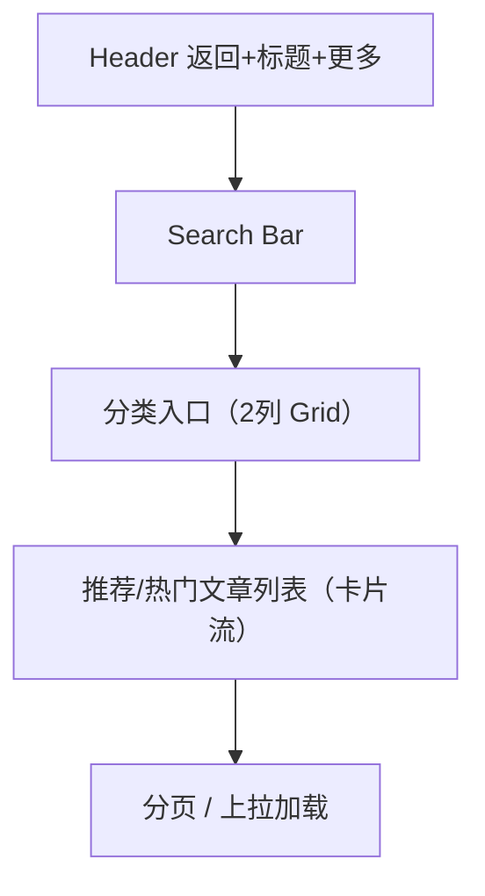

# 知识库大厅 页面设计

## 版本记录
| 日期 | 版本 | 修改内容 | 作者 |
|---|---|---|---|
| 2026-01-11 | v1.0 | 初始设计：知识库大厅视觉与交互规范 | View-Forge |
| 2026-01-12 | v1.1 | 融合新要求：补充无障碍、响应式、状态与微交互细节，优化分类与推荐区块，完善底部导航与全局一致性 | View-Forge |

## 1. 页面概述
- **用户目标**：为孤独症家庭及专业服务者提供权威、易查找的知识内容，支持多方式检索与高效阅读，兼顾情感安抚与专业信任。
- **关键操作**：
  1. 关键词搜索与智能建议
  2. 分类浏览与快速跳转
  3. 文章详情访问、收藏、分享与反馈

## 2. 视觉布局
- **目标前端类型**：Mobile H5 优先，兼容 PC Web 响应式扩展。
- **整体结构**：
  - 顶部 Header（带返回、标题、操作）
  - 搜索栏（黏性悬浮，便于随时检索）
  - 分类入口区（2列 Grid 卡片，色彩点缀，图标美化）
  - 推荐/热门文章流（卡片式列表，信息分层，缩略图点缀）
  - 底部导航（一级页面时显示，主色高亮，图标与文案并重）
  - 空态/加载态（美观占位，骨架屏动画，提升等待体验）

### 2.1 结构图（Mermaid）

### 2.2 布局参数（移动端首选）
- 页面宽度自适应主流手机（360–412px），内容区最大宽度为视口减去安全边距（左右各8px）。
- 全局间距以8px为基准，区块间距适度留白，提升呼吸感。
- 分类区采用2列网格，列间距适中，卡片圆角与阴影柔和，突出可点性。
- 推荐区卡片流式排列，卡片间距均匀，缩略图与文本信息分区明确。

## 3. 组件细节（从上到下）

### 3.1 顶部 Header
- 组件名：Header [Bar]
- 相对尺寸与位置：顶部固定，宽度随屏自适应，高度相对较高，左右安全边距明显。
- 样式细节：背景色采用云雾灰（#F4F6F8），底部分割线极细弱化。返回图标与操作按钮均为主文本色，悬停/按下时主色轻微遮罩，提升可点性。
- 内容规范：左侧返回（<）图标，中央加粗标题，右侧可选操作（如筛选/收藏）。
- 状态样式：悬停/按下有主色8%遮罩，图标aria-label，色彩对比达AA级。

### 3.2 搜索栏（Search Bar）
- 组件名：Search Input
- 相对尺寸与位置：Header下方黏性悬浮，宽度自适应，左右留有安全边距。
- 样式细节：白色背景，圆角柔和，主色边框聚焦时高亮，内阴影提升层次。占位符与输入文本对比明显，图标点缀提升识别度。
- 交互：聚焦时主色高亮，外阴影柔和，语音/清除图标易触达。

### 3.3 分类入口区（Category Grid）
- 组件名：Category Card（2列Grid）
- 相对尺寸与位置：主内容区上方，2列等宽分布，卡片间距均匀。
- 样式细节：卡片白底、圆角大、辅色/强调色点缀图标，阴影极浅，提升悬浮感。主标题加粗，副标题次之，整体色彩和谐。
- 行为：点击卡片跳转分类，长按弹出收藏/分享菜单（移动端），卡片hover时轻微提升。

### 3.4 推荐/文章卡片列表（Feed）
- 组件名：Article Card（流式列表项）
- 相对尺寸与位置：主内容区下方，卡片宽度自适应，间距均匀。
- 样式细节：卡片白底、圆角大，标题加粗，摘要与元信息弱化，缩略图右侧点缀，提升信息密度但不拥挤。
- 操作：点击进入详情，右滑弹出操作菜单，hover时卡片提升并加阴影。

### 3.5 空态 & 加载态
- 空态：主内容区中央展示大图标（open-book），主色点缀，主标题与副文案分层，整体居中，提示友好。
- 加载态：骨架屏动画，卡片轮廓与缩略图均有脉动效果，提升等待体验。

### 3.6 底部导航（一级页面时）
- 组件名：Bottom Tab Bar
- 相对尺寸与位置：页面底部固定，宽度自适应，图标与文案垂直居中。
- 样式细节：主色高亮选中项，未选项中性色，圆角与阴影弱化，提升整体和谐美观。

## 4. 交互说明
- 搜索栏输入时，300ms防抖触发智能建议，建议列表悬浮于输入框下方，支持键盘与触控选择。
- 回车或点击“搜索”按钮，进入关键词筛选结果，筛选状态可返回保留。
- 分类卡片点击跳转，Header返回逻辑：如无历史栈则回首页。
- 文章卡片点击进入详情，右滑/长按弹出收藏、分享、反馈等操作。
- 上拉加载更多，底部loading动画，滚动至顶部时浮现“回到顶部”主色圆形按钮。
- 所有交互目标触控区不小于44x44px，图标aria-label，色彩对比达AA级。

## 5. 适配与响应式
- **Mobile H5**：单列流式，控件触控目标充足，Header固定，Search黏性，分类2列Grid，底部Tab常驻。
- **PC Web**：主内容区宽度放大，分类区可扩展为4列Grid，推荐区卡片两列瀑布流，侧边栏可显示热门标签或筛选，卡片hover提升与阴影更明显，主色与图标点缀提升视觉层次。

## 6. 无障碍与国际化
- 所有文本可放大至200%不破坏布局，重要状态除色彩外有icon/文案辅助。
- 图标均有aria-label，Tab与卡片可键盘导航，焦点高亮明显。
- 所有文案支持i18n，默认中文简体，预留英文切换。

## 7. 设计参考与实现提示
- 组件库建议：Ant Design Mobile / Vant 移动端Input、List、Grid为主，必要时自定义样式以匹配色彩令牌。
- 性能优化：分页/游标上拉加载，图片懒加载，骨架屏提升体验。
- 埋点追踪：文章卡片需埋点曝光、点击、收藏、分享等事件。
- 视觉一致性：所有圆角、阴影、色彩严格遵循全局设计系统，分类与推荐区块色彩点缀与主色/辅色/强调色协调。

---
设计完成。若需要我可以：
- 将此文档合并到仓库（已创建文件）。
- 生成对应的 Figma / Zeplin 元素规范（颜色/间距切片）。
