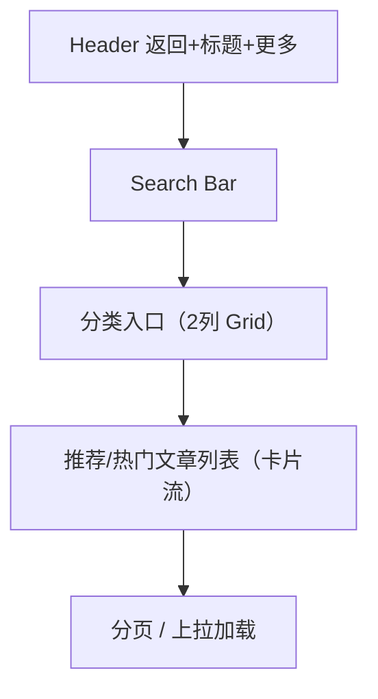

# 知识库大厅 页面设计

## 版本记录
| 日期 | 版本 | 修改内容 | 作者 |
|---|---|---|---|
| 2026-01-11 | v1.0 | 初始设计：知识库大厅视觉与交互规范 | View-Forge |

## 1. 页面概述
- **用户目标**：快速查找与阅读针对孤独症关怀/养护/训练的知识文章、指南与问答；能通过关键词检索、分类浏览并进入文章详情或收藏、分享。
- **关键操作**：
  - 搜索：输入关键词快速定位内容。
  - 分类浏览：浏览一级/二级分类卡片并进入列表。
  - 打开文章：进入文章详情，查看来源与引用卡片，支持收藏/分享/反馈。

## 2. 视觉布局
- **目标前端类型**：Mobile H5 优先（单列流式），同时提供 PC Web 可扩展说明。
- **整体结构（宏观）**：
  - Header（带返回+标题+操作）
  - Search Bar（悬浮/黏性在顶部下方）
  - 分类入口区（Grid：2列小卡片）
  - 热门/推荐列表（流式卡片列表）
  - 底部（仅在一级页面情况显示底部 Tab）

### 2.1 结构图（Mermaid）

### 2.2 布局参数（移动端首选）
- 页面宽度（视口）：360–412px（常见手机）
- 内容最大宽度：viewport - 16px（左右 safe area 各8px）
- 全局间距基数：8px
  - 大间距：24px
  - 中间距：16px
  - 小间距：8px
- 栅格：分类区采用 2 列网格，列间距 `12px`。

## 3. 组件细节（从上到下）

### 3.1 顶部 Header
- 组件名：Header [Bar]
- 尺寸与位置：高度 56px；上下内边距 0；左右 Safe 8px；顶部与状态栏间距 12px（可根据设备自动调整）。
- 样式细节：背景色 `#F4F6F8`（页面背景同）、底部无阴影或使用细线分割 `1px solid rgba(44,62,80,0.06)`。
- 内容规范：
  - 左侧：返回图标（尺寸 20x20px，命中面积 44x44px）。图标颜色 `#2C3E50`（不纯黑）。
  - 中间：标题文字“知识库”（字号 16px，字重 600，颜色 `#2C3E50`）。
  - 右侧：操作按钮（筛选/收藏/排序 可选，图标 20x20px，触控面积 44x44px）。
- 状态样式：
  - 悬停/按下（PC）：图标背景 8% 主色遮罩。
  - 无障碍：图标有 aria-label 与足够对比。

### 3.2 搜索栏（Search Bar）
- 组件名：Search Input [输入框 + 语音/清除图标]
- 尺寸与位置：高度 44px；左右 margin 16px；位于 Header 下方，纵向间距 12px。
- 样式细节：
  - 背景：`#FFFFFF`
  - 边框：`1px solid #E5E7EB`
  - 圆角：10px
  - 内边距：左右 12px
  - 占位文字色：`#9CA3AF`（字号 14px）
  - 搜索图标置左（24x24px），语音/清除小图标置右（24x24px，命中面积 44x44px）。
- 交互：Focus 时边框色变为主色 `#4A90E2`，并显示微弱外阴影（0 2px 6px rgba(74,144,226,0.12)）。

### 3.3 分类入口区（Category Grid）
- 组件名：Category Card [2-col Grid]
- 尺寸与位置：卡片高度 84px；列间距 12px；行间距 12px；左右内边距 16px。
- 每张卡片样式：
  - 背景：`#FFFFFF`
  - 圆角：12px
  - 阴影：0 1px 2px rgba(44,62,80,0.04)
  - 左侧图标/Illustration：40x40px，圆角 8px 或圆形，使用辅色/强调色点缀（示例：图标背景 `#50E3C2`/`#F5A623`）。
  - 文案：主标题 15px/600，副标题（可选）12px/400，颜色 `#2C3E50`。
- 行为：点击卡片进入分类文章列表；长按（Mobile）显示收藏/分享快捷菜单（可选）。

### 3.4 推荐/文章卡片列表（Feed）
- 组件名：Article Card [List Item]
- 尺寸与位置：卡片高度可变（最小 88px）；左右 padding 16px；内容为 1 行标题 + 1 行元信息/摘要。
- 样式细节：
  - 背景：透明（列表背景为 `#F4F6F8`），每个卡片使用白色小面板（`#FFFFFF`）和 12px 圆角。
  - 标题：16px/600，颜色 `#2C3E50`，行高 20px，最多 2 行溢出省略。
  - 摘要/元信息：12px/400，颜色 `#7B8794`（或 `rgba(44,62,80,0.56)`），包含来源、阅读时长、发布时间等（间隔使用•分隔）。
  - 缩略图（可选）：右侧 72x48px，圆角 6px。
- 操作：右滑（Mobile）弹出“收藏/标记/分享”操作；点击卡片进入 `/knowledge/:id` 详情页。

### 3.5 空态 & 加载态
- 空列表：显示占位卡片高度 160px，内含图标（示例：open-book 图），标题 16px 文案“暂无相关文章”，副文案 14px 指导用户使用搜索或切换分类。
- 加载态：使用骨架屏（skeleton）占位：每个文章卡显示带圆角灰色块，渐变脉动动画，约 3 条占位项。

### 3.6 底部（若作为一级页面展示）
- 使用项目全局底部 Tab（首页/我的），高度 56px，图标与文案垂直居中，选中态主色填充 `#4A90E2`。

## 4. 交互说明
- 搜索：
  - 实时建议：输入触发防抖（300ms）请求建议，展示在搜索框下方悬浮列表（最多 5 条），按方向键或触摸选择。
  - 回车/点击“搜索”：进入带关键词筛选的结果页（当前页内滚动或跳转均可，建议保留筛选状态以便返回）。
- 分类入口：点击直接跳转到该分类列表，上方保留分类面包屑；从 URL 直接访问时 Header 返回执行回首页 `/`。
- 列表操作：
  - 上拉加载：触发下一页数据请求（loading indicator 位于列表底部）；滚动到顶部时展示“回到顶部”浮动按钮（直径 44px，主色背景）。
  - 卡片交互：点击进入详情，长按弹出更多操作（收藏/分享/反馈）。
- 可访问性：
  - 所有触控目标至少 44x44px；图标按钮提供 aria-label；色彩对比遵循 WCAG AA（文本与背景）。

## 5. 适配与响应式
- Mobile H5（主视图）：单列流式，全部控件触控目标 >=44px；分类为 2 列网格；Header 固定，Search 为黏性元素以便快速搜索。
- Tablet / Desktop：
  - 宽屏容器最大宽度 1200–1400px，左右内边距 24px。
  - 分类区可扩展为 4 列 Grid；列表采用两列卡片瀑布或侧栏 + 内容主区布局。
  - 鼠标悬停：卡片在 hover 时提升（transform: translateY(-4px)），并展示阴影（0 6px 18px rgba(44,62,80,0.08)）。

## 6. 无障碍与国际化
- 文本可放大到 200% 不破坏布局；重要颜色提供非色彩依赖的状态（例如 icon + 文本标签）。
- 所有文案走 i18n 管线，支持中文简体与后续英文切换。

## 7. 设计参考与实现提示
- 组件库：建议使用 `Ant Design Mobile` / `Vant` 的移动版 Input、List、Grid 组件作为基础；必要时做轻量自定义样式以匹配色彩令牌。
- 性能：列表使用分页或 cursor-based 上拉加载，图片采用懒加载与占位骨架。
- 追踪：在文章卡片上埋点：曝光、点击、收藏、分享四类事件。

---
设计完成。若需要我可以：
- 将此文档合并到仓库（已创建文件）。
- 生成对应的 Figma / Zeplin 元素规范（颜色/间距切片）。
