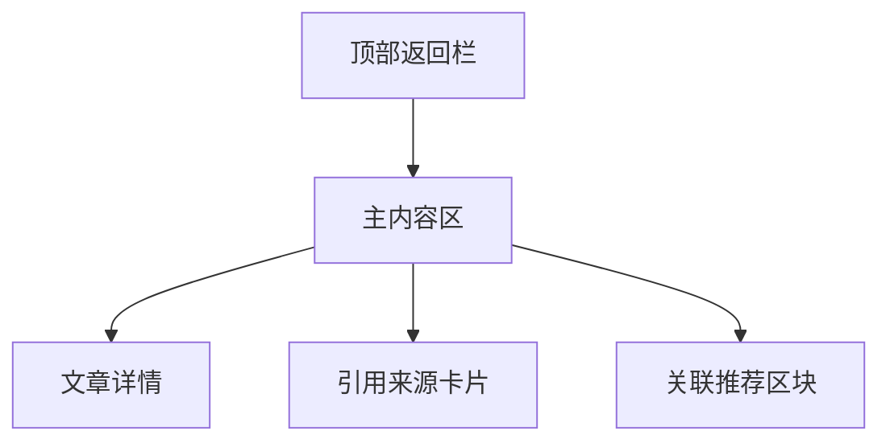

# 知识详情页 页面设计

## 版本记录
| 日期 | 版本 | 修改内容 | 作者 |
|---|---|---|---|
| 2026-01-12 | v1.0 | 初始设计 | View-Forge |

## 1. 页面概述
- **用户目标**：深入阅读知识库文章，获取权威信息，发现相关知识。
- **关键操作**：浏览文章内容、查看引用来源、跳转关联推荐。

## 2. 视觉布局
- **整体结构**：页面采用标准次级页面布局，顶部为带返回按钮的 Header，主体为纵向滚动内容区。内容区视觉重心突出文章标题与正文，引用来源与推荐区块分明，整体层次清晰。
- **结构图示**：

- **布局参数**：
    - Header 高度适中，左侧返回按钮，居中标题，右侧可留空。
    - 主内容区宽度自适应，左右留有适度空白，提升阅读舒适度。
    - 文章区块与引用、推荐区块之间有明显分隔，整体布局流畅。

## 3. 组件细节
### 3.1 顶部返回栏 [Header]
- **相对尺寸与位置**：固定于页面顶部，宽度与页面等宽，高度适中。
- **样式细节**：背景色为云雾灰（#F4F6F8），左侧为圆角返回按钮（静谧蓝 #4A90E2），中间为页面标题“知识详情”，字体加粗。
- **内容规范**：标题采用大号字体，主色文本色（#2C3E50），按钮悬停时主色加深。
- **状态样式**：返回按钮点击有轻微缩放与阴影反馈。

### 3.2 文章详情区块 [Article]
- **相对尺寸与位置**：位于主内容区顶部，宽度适中，左右留白。
- **样式细节**：
    - 标题大号加粗，主文本色。
    - 文章正文分段清晰，行距充足，正文与背景色对比柔和。
    - 重要段落可用 Accent 色（#F5A623）点缀引用标记。
- **内容规范**：
    - 标题：24px-28px 等效大号字体，字重突出。
    - 正文：16px-18px 等效，易读性高。
- **状态样式**：选中文字时高亮色为主色淡化版。

### 3.3 引用来源卡片 [Reference]
- **相对尺寸与位置**：位于正文下方，单独卡片形式，左右留白。
- **样式细节**：
    - 卡片背景为白色，圆角柔和，阴影轻微。
    - 左侧引用图标（Lucide/Antd），主色点缀。
    - 来源标题加粗，来源链接为主色下划线。
- **内容规范**：
    - 来源描述小号字体，文本色为深灰蓝。
- **状态样式**：链接悬停时主色加深，卡片悬停有轻微提升阴影。

### 3.4 关联推荐区块 [Related]
- **相对尺寸与位置**：位于页面底部，独立区块。
- **样式细节**：
    - 区块顶部有“相关推荐”标题，主色加粗。
    - 推荐项以卡片或列表形式横向或纵向排列，卡片有主色边框点缀。
    - 每项含标题、简要描述、跳转按钮（主色）。
- **内容规范**：
    - 推荐标题中号字体，描述小号字体。
- **状态样式**：卡片悬停主色边框加深，跳转按钮点击有主色阴影。

## 4. 交互说明
- **返回操作**：点击左上角返回按钮，优先 history.back()，无历史时跳转首页。
- **引用来源**：点击来源链接新开标签页访问原文。
- **相关推荐**：点击推荐项跳转至对应知识详情页，当前页面平滑过渡。
- **加载与缺省**：
    - 加载中显示主色 Loading 动画，整体居中。
    - 无数据时展示柔和色彩的空状态插画与提示文字。

## 5. 适配与响应式
- **Mobile H5**：
    - 单列流式布局，主内容区宽度自适应，按钮与卡片触控目标充足。
    - Header 固定顶部，内容区滚动。
    - 推荐区块可横向滑动。
- **PC Web**：
    - 主内容区宽度适当放宽，左右留白增大，推荐区块可多列展示。
    - 悬停交互更丰富，卡片与按钮有细腻阴影与色彩反馈。
- **WeChat Mini Program**：
    - 遵循小程序原生导航栏规范，引用与推荐区块风格贴合平台，避免复杂浮层。
