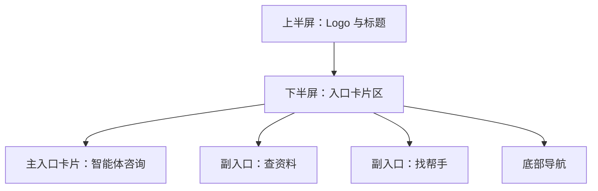

# 首页 页面设计

## 版本记录
| 日期 | 版本 | 修改内容 | 作者 |
|---|---|---|---|
| 2026-01-11 | v1.0 | 初始设计：Logo+1+2 布局的像素级规范 | View-Forge |
| 2026-01-11 | v1.1 | 调整布局：上半部分为程序 Logo 与标题，下半部分为 3 个入口卡片 | View-Forge |

## 1. 页面概述
- **用户目标**：快速启动智能体咨询（低门槛对话入口）、查找资料与专家/志愿者（快速进入常用功能），以及便捷访问个人中心。  
- **关键操作**：
  - 点击主入口卡片“智能体咨询”并开始对话（首选动作）。
  - 点击任一副入口（查资料 / 找帮手）进入对应列表页。
  - 底部导航切换：首页 ↔ 个人中心。

## 2. 视觉布局
- **整体结构（宏观）**：
  - 上半部分（Top）：程序 Logo 区与页面标题（占上半屏）。
  - 下半部分（Bottom）：主入口卡片（大卡，1）与两个副入口卡片（并排/堆叠，2），位于下半屏展示。
  - 底部：固定底部导航栏（高度 64px）。

- **布局参数（Mobile First）**：
  - 视口小于 768px（Mobile H5 默认）
    - 页面左右内边距（Padding）：16px
    - 上半屏 Logo 区高度：40vh（最小 160px，最大 260px），Logo 图标 48x48px，Logo 文本字号 20px，标题与副标题居中排列。
    - 下半屏为入口卡片区：主入口卡片宽度 100%（容器宽度 - 32px），高度 220px，圆角 12px；副入口卡片（两列并排）每项宽度 calc((100% - 12px) / 2)，高度 96px，圆角 10px，水平间距 12px，垂直间距 12px。
    - 底部导航高度：64px，安全区底部 Padding 8px（适配 iOS/Android 底部安全区）。
  - 视口 ≥ 1024px（PC Web）
    - 页面最大容器宽度：1280px（居中），左右 Padding：24px。  
    - 布局按横向分区：上半屏为 Logo 与标题（垂直空间固定比例），下半屏为 1+2 横向布局，主入口占 62% 宽度（左列），右列为两张副入口垂直堆叠（每项高度 140px），主入口高度 360px，间距 24px。

## 3. 组件细节（从上到下）

### 3.1 Logo 区
- **组件名**：Logo 区 [容器]
- **尺寸与位置**：上半屏高度 40vh（最小 160px，最大 260px），左右 Padding 16px（Mobile）；PC 时上半屏同样建议 40vh 或固定 200px，左右 Padding 24px。Logo 与页面标题在上半屏内垂直居中排列（Logo 可置左侧或居中显示），右侧留白用于页面描述或可选快捷入口。  
- **样式细节**：背景色：透明（使用页面背景 `#F4F6F8`），Logo 文本颜色 `#2C3E50`，Logo 图标 48x48 圆角 8px。  
- **内容规范**：Logo 文本：字号 20px，字重 700，行高 28px；副标题（可选）字号 14px，颜色 `#6B7280`。  
- **交互**：Logo 为非交互主元素（Home 页面无返回）。

### 3.2 主入口卡片 — 智能体咨询
- **组件名**：主入口卡片 [大卡]
- **尺寸与位置**：Mobile 宽度 100%，高度 220px，边距顶部 12px；PC 左栏宽度 62%，高度 360px。  
- **样式细节**：
  - 背景：`#FFFFFF`（白色卡片）
  - 圆角：12px
  - 阴影：0 6px 18px rgba(44,62,80,0.06)
  - 内边距（Padding）：16px
  - 主色强调条或 CTA 按钮使用 `#4A90E2`（主色）。
- **内容规范**：
  - 标题：字号 20px，字重 600，颜色 `#2C3E50`。  
  - 副标题 / 描述：字号 14px，颜色 `#6B7280`，行高 20px。  
  - 主操作按钮：圆角 8px，高度 44px，填充色 `#4A90E2`，文案白色（字号 16px，字重 600）；按钮左侧可放 20x20 图标。  
- **图标与占位**：卡片左上或居中可放 64x64 图形/插图（带情感但低刺激，使用主色与背景渐变）。
- **状态样式**：
  - Hover (PC)：提升阴影为 0 12px 28px rgba(44,62,80,0.08)，向上移动 -4px，过渡 150ms ease.
  - Active / Press：scale 0.995，阴影减弱，立即响应。
  - Disabled：背景 `#F3F4F6`，文案颜色 `#9CA3AF`，按钮不可点击。
  - Focus（键盘）：外部环形描边 3px `rgba(74,144,226,0.18)`。

### 3.3 副入口卡片 — 查资料、找帮手
- **组件名**：副入口卡片 [小卡]
- **尺寸与位置**：Mobile 每项宽度 (容器-32px - 12px)/2，高度 96px，圆角 10px，内边距 12px。  
- **样式细节**：
  - 背景：`#FFFFFF`，边框 1px solid `#E6E9EE`。  
  - 标题字号 16px（字重 600），描述 12-14px。  
  - 图标尺寸 28x28，放置于左侧或右上角做视觉引导。  
- **交互**：
  - Tap：卡片快速到达目标页，按下时短促高亮 `rgba(74,144,226,0.06)`。  
  - Hover：轻微提升（translateY -2px）和更深阴影（PC）。

### 3.4 底部导航（Tab Bar）
- **组件名**：底部导航 [固定]
- **尺寸与位置**：高度 64px，左右 Padding 16px，固定屏幕底部。  
- **样式细节**：
  - 背景：`#FFFFFF`，上边框 1px solid `#E9EEF3`。
  - Icon 大小：24x24；标签字号 12px，颜色默认 `#6B7280`，激活态主色 `#4A90E2`。  
- **交互**：
  - 激活态：图标与文字颜色变为 `#4A90E2`，图标可带 2px 下沉投影。  
  - 长按（移动）：显示 Tooltip（仅在 PC/Tablet 可见）。

### 3.5 页面背景与色彩令牌
- **页面背景**：`#F4F6F8`（云雾灰）。  
- **主要色彩**：
  - 主色（Primary）：`#4A90E2` — 用于 CTA、激活态。  
  - 辅助色（Secondary）：`#50E3C2` — 成功/正面反馈。  
  - 强调色（Accent）：`#F5A623` — 警示/暖心引导（谨慎使用）。  
  - 文本主色：`#2C3E50`，说明文字 `#6B7280`，占位/禁用 `#9CA3AF`。

### 3.6 排版（Typography）
- **字体族**：系统优先（-apple-system, BlinkMacSystemFont, 'Segoe UI', Roboto, 'Helvetica Neue', Arial）。
- **字号规范**：
  - H1 / 页面主标题（仅用于大卡主标题在 PC 展示）：28px / 600
  - 卡片主标题：20px / 600
  - 正文文本：16px / 400
  - 辅助说明：14px / 400
  - 元信息 / 标签：12px / 400

## 4. 交互说明
- **页面流与跳转**：
  - 点击主入口卡片 `智能体咨询`：进入 `/consultation`，过渡动画：从右侧滑入（300ms）。
  - 点击副入口：进入对应次级页面（`/knowledge` 或 `/community`），使用相同滑动过渡。  

- **输入与键盘**：
  - 在咨询页面（非首页）输入框应避免被虚拟键盘遮挡（监听 viewport resize 并滚动至可见）。

- **加载态与空态**：
  - 卡片内部加载：居中圆形 Spinner（颜色 `#4A90E2`），文案 `加载中...`（14px）。
  - 空态：使用简洁插图（低饱和）+ 说明文字（14px，`#6B7280`）+ 操作按钮（主色）。

- **无历史栈返回兜底（整体规则来自设计方案）**：
  - 若从外部直接访问次级页面，返回按钮应回到首页 `/`（这里为首页无需返回）。

## 5. 适配与响应式
- **Mobile H5（Primary）**：
  - 单列流式布局；Tap 目标最小 44x44px；主间距 16px；副入口并排两列（如空间不足则竖排）。
  - 动效简洁：仅保留卡片提升与按钮反馈，避免长动画。  

- **PC Web**：
  - 最大宽度 1280px；采用 1+2 横向布局（主入口左、两副入口右侧垂直排列）。
  - 支持 Hover、Tooltip 与更丰富的阴影态；主按钮宽度可设置为固定 220px。  

- **无障碍与对比**：
  - 确保正文与背景对比度 ≥ 4.5:1（使用 `#2C3E50` 与 `#F4F6F8` 的组合）；按钮文字白色与 `#4A90E2` 背景对比度需通过 WCAG 检查。  

## 6. 空态 / 错误 / 成功示例
- **空态（查不到内容）**：插图高度 140px，说明文字 14px，操作按钮 44px 高，圆角 8px，主色 `#4A90E2`。  
- **表单错误提示**：错误文案颜色 `#E02424`（或系统红），字号 12px，展示在控件下方 6px 间距。  
- **成功反馈**：顶部短暂 Toast，背景 `#50E3C2`，图标 16x16，文案 14px，时长 2s。

## 7. 交付与后续建议
- **交付文件**：已生成本设计文档，供前端实现参考。  
- **建议优先实现清单**：
  - 优先实现移动端主入口卡片与底部导航的可交互原型（关键路径）。
  - 与产品约定主入口的文案与图标素材（风格需低饱和）。
  - 提交给前端后建议做一次无障碍对比度检查与触控目标测试。

---
参考：
- 前端界面设计方案：[“心青年”智能体平台-前端界面设计方案.md](docs/“心青年”智能体平台-前端界面设计方案.md)
