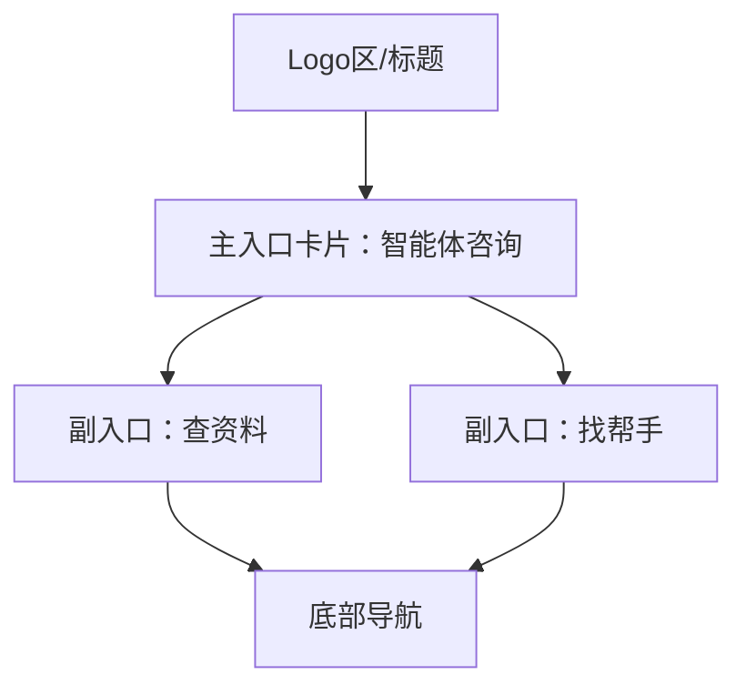

# 首页 页面设计

## 版本记录
| 日期 | 版本 | 修改内容 | 作者 |
|---|---|---|---|
| 2026-01-11 | v1.0 | 初始设计：Logo+1+2 布局的像素级规范 | View-Forge |
| 2026-01-11 | v1.1 | 调整布局：上半部分为程序 Logo 与标题，下半部分为 3 个入口卡片 | View-Forge |
| 2026-01-12 | v1.2 | 融合前端界面设计方案，细化色彩、交互、无障碍与响应式规范 | View-Forge |
| 2026-01-13 | v1.3 | 新增“统一服务中心”首页内嵌容器的模块化入口与交互补充 | View-Forge |

## 1. 页面概述
- **用户目标**：快速启动智能体咨询（低门槛对话入口）、查找资料与专家/志愿者（快速进入常用功能），以及便捷访问个人中心。  
- **关键操作**：
  - 点击主入口卡片“智能体咨询”并开始对话（首选动作）。
  - 点击任一副入口（查资料 / 找帮手）进入对应列表页。
  - 底部导航切换：首页 ↔ 个人中心。

## 2. 视觉布局

**结构图示（Mermaid）**：

**布局参数（相对描述）**：
- 上半屏Logo区占整体高度约40%，内容垂直居中。
- 下半屏主入口卡片占据视觉重心，副入口卡片并排（Mobile）或右侧垂直堆叠（PC）。
- 底部导航固定，主内容区与底部有安全间距。

- **布局参数（Mobile First）**：
  - 视口小于 768px（Mobile H5 默认）
    - 页面左右内边距适中，内容不贴边，保证触控舒适。
    - 上半屏 Logo 区高度约占整体视口 40%，内容垂直居中，Logo 图标相对较大，品牌名突出，副标题居中辅助说明。
    - 下半屏为入口卡片区：主入口卡片宽度占满主内容区，视觉重心突出，圆角柔和；副入口卡片并排分布，各占一半空间，间距均匀，圆角明显，整体布局呼吸感强。
    - 底部导航高度适中，始终固定于底部，并与主内容区有安全间距，适配不同设备底部安全区。
  - 视口 ≥ 1024px（PC Web）
    - 页面最大内容区宽度受限于大屏，整体居中，左右留有适度空白。
    - 布局采用横向分区，上半屏为 Logo 与标题，保持垂直居中，下半屏为主入口卡片与副入口卡片横向排列，主入口卡片占据左侧大部分空间，副入口卡片在右侧垂直堆叠，主副入口间距明显，层次分明。

## 3. 组件细节（从上到下）

### 3.1 Logo 区
- **组件名**：Logo 区 [容器]
- **相对尺寸与位置**：位于页面上半部分，整体高度约占40%，内容垂直居中，左右留白适中。Logo 图标相对较大，品牌名居中突出，副标题辅助说明。
- **样式细节**：背景色为页面主背景，Logo 文本色深灰蓝，图标圆角柔和，整体风格温和安抚。
- **内容规范**：品牌名字重突出，副标题低饱和，整体排版简洁有序。
- **交互**：Logo区为纯展示，无交互。

### 3.2 主入口卡片 — 智能体咨询
- **组件名**：主入口卡片 [大卡]
- **相对尺寸与位置**：下半屏视觉重心，宽度占主内容区大部分空间，Mobile 下为整行，PC 下为左侧主区。
- **样式细节**：白色卡片，圆角柔和，阴影轻盈，主色强调条或按钮突出，插图低饱和，整体风格温和。
- **内容规范**：主标题突出，副标题辅助，按钮主色填充，图标点缀，排版有呼吸感。
- **状态样式**：
  - Hover（PC）：卡片阴影加深，微微上浮，按钮主色加深。
  - Active/Press：卡片轻微缩放，按钮色变浅。
  - Disabled：卡片灰化，按钮不可点。
  - Focus：主色环形描边。

### 3.3 副入口卡片 — 查资料、找帮手
- **组件名**：副入口卡片 [小卡]
- **相对尺寸与位置**：主入口卡片下方并排（Mobile），各占一半宽度，PC 下为主卡右侧垂直堆叠。
- **样式细节**：白色卡片，边框淡灰，圆角明显，图标点缀，主色/辅助色区分，整体布局紧凑有序。
- **内容规范**：标题加粗，描述辅助，图标清晰，整体视觉层次分明。
- **状态样式**：
  - Tap：主色高亮，卡片阴影加深。
  - Hover（PC）：卡片微浮起，边框主色。
  - Disabled：卡片灰化，文字变淡。

### 3.4 底部导航（Tab Bar）
- **组件名**：底部导航 [固定]
- **相对尺寸与位置**：固定于页面底部，宽度100%，内容居中，主内容区与底部有安全间距。
- **样式细节**：白色背景，主色激活，图标与标签相对较大，圆角按钮，整体风格简洁。
- **内容规范**：标签清晰，主色激活，辅助色未选，整体排版有序。
- **状态样式**：
  - 激活：主色高亮，图标下沉阴影。
  - Hover（PC）：主色描边。
  - Disabled：标签变淡。

### 3.5 页面背景与色彩令牌
- **页面背景**：整体为云雾灰，主内容区与卡片均有圆角与阴影，提升层次感。
- **主要色彩**：主色用于主按钮、激活态，辅助色用于正面反馈，强调色仅用于警示/暖心引导，文本主色与背景对比度高，说明文字低饱和，禁用色弱化视觉。

### 3.6 排版（Typography）
- **字体族**：系统优先，字重突出主次，整体风格温和易读。
- **字号规范**：主标题相对较大，副标题与正文适中，标签较小，行高充足，提升可读性。

## 4. 交互说明
- **页面流与跳转**：
  - 点击主入口卡片 `智能体咨询`：进入 `/consultation`，过渡动画：从右侧滑入（300ms）。
  - 点击副入口：进入对应次级页面（`/knowledge` 或 `/community`），使用相同滑动过渡。  

- **输入与键盘**：
  - 在咨询页面（非首页）输入框应避免被虚拟键盘遮挡（监听 viewport resize 并滚动至可见）。

- **加载态与空态**：
  - 卡片内部加载：居中圆形 Spinner（颜色 `#4A90E2`），文案 `加载中...`（14px）。
  - 空态：使用简洁插图（低饱和）+ 说明文字（14px，`#6B7280`）+ 操作按钮（主色）。

- **无历史栈返回兜底（整体规则来自设计方案）**：
  - 若从外部直接访问次级页面，返回按钮应回到首页 `/`（这里为首页无需返回）。

## 5. 适配与响应式
- **Mobile H5（Primary）**：
  - 单列流式布局，内容区块纵向排列，主入口与副入口卡片间距适中，副入口并排两列（如空间不足则竖排）。
  - 所有交互目标均有充足触控空间，保证易用性。
  - 动效简洁，仅保留卡片提升与按钮反馈，避免长动画。

- **PC Web**：
  - 页面最大内容区宽度受限于大屏，整体居中，主入口与副入口横向分区，主入口左侧占比更大，副入口右侧垂直堆叠。
  - 支持 Hover、Tooltip 与更丰富的阴影态，主按钮宽度相对主内容区适中。

- **无障碍与对比**：
  - 确保正文与背景对比度 ≥ 4.5:1（使用 `#2C3E50` 与 `#F4F6F8` 的组合）；按钮文字白色与 `#4A90E2` 背景对比度需通过 WCAG 检查。  

## 6. 空态 / 错误 / 成功示例
- **空态（查不到内容）**：插图高度 140px，说明文字 14px，操作按钮 44px 高，圆角 8px，主色 `#4A90E2`。  
- **表单错误提示**：错误文案颜色 `#E02424`（或系统红），字号 12px，展示在控件下方 6px 间距。  
- **成功反馈**：顶部短暂 Toast，背景 `#50E3C2`，图标 16x16，文案 14px，时长 2s。

## 7. 交付与后续建议
- **交付文件**：已生成本设计文档，供前端实现参考。  
- **建议优先实现清单**：
  - 优先实现移动端主入口卡片与底部导航的可交互原型（关键路径）。
  - 与产品约定主入口的文案与图标素材（风格需低饱和）。
  - 提交给前端后建议做一次无障碍对比度检查与触控目标测试。

  ## 8. 统一服务中心（首页内嵌容器） — 设计补充
  - **主标题**：统一服务中心
  - **定位**：作为首页内嵌区块，仅对 Support 角色（志愿者/专家/管理员）可见，提供快速入口与轻量工作台能力，支持展开侧栏进行快速处理。

  ### 8.1 总体布局与承载形式
  - **容器形态**：位于首页主内容区下方，以一张白色卡片/分区容器承载，卡片顶部为主标题“统一服务中心”，右侧显示快速操作按钮与折叠/展开控件。
  - **占位与层次**：在 Mobile 下该容器为单列块，横向占满内容区且与其他卡片保持统一间距；在大屏（PC）下可作为主内容的右侧或下部快捷区块，支持展开为侧滑面板（从右侧 320–420px 展开）。
  - **可见性规则**：仅当当前用户角色属于 Support 且已登录时渲染；Guest/Family 不渲染该区块。

  ### 8.2 模块化副标题与入口组织
  按模块分区，每个模块下列出首页内的“快捷入口卡片/行项”，入口指向对应次级页面（路径以项目路由为准）。视觉上采用卡片网格或行列表，支持展示未读/待办徽章（红点或数字）。

  - **知识管理（Knowledge）**
    - 副标题：知识管理
    - 入口项：知识贡献（`/workspace/contribute`）、知识审核列表（`/workspace/review`）、审核详情（`/workspace/review/:id`）
    - 视觉/交互：以两列小卡或可展开的行项呈现，审核入口显示待审核条目数，点击进入审核列表或侧滑打开最近待审核项预览，支持直接进入审核详情进行处理。

  - **任务 / 工单（Tasks / Tickets）**
    - 副标题：任务与工单
    - 入口项：任务大厅（`/workspace/tasks`）、工单处理（`/workspace/tickets/:id`）、发起/认领入口
    - 视觉/交互：行式列表为主，带快速动作按钮（接单/查看/回复），长按或悬停显示更多操作，支持工单优先级颜色条（低/中/高）。

  - **排班 / 活动（Schedule）**
    - 副标题：排班与活动管理
    - 入口项：排班管理（`/workspace/schedule`）
    - 视觉/交互：展示即将到来的班次卡片，支持报名/取消与查看详情的快捷按钮，班次满员时显示灰化与提示。

  - **数据 / 服务记录（History）**
    - 副标题：服务记录
    - 入口项：服务记录（`/workspace/history`）
    - 视觉/交互：小型统计卡 + 最近记录列表，支持跳转到详情查看服务时长与历史工单。

  - **系统管理（Admin）**
    - 副标题：系统管理（仅管理员可见）
    - 入口项：人员管理（`/admin/users`）、运维监控（`/admin/logs`）
    - 视觉/交互：仅在角色权限允许时渲染，入口以图标行项展示，可展示待处理审批数与告警摘要，点击进入管理控制台。

  ### 8.3 交互细节（首页内嵌容器特有）
  - **展开行为**：点击模块卡片可在当前页面右侧侧滑打开该模块的轻量面板（宽度 320–420px），面板内可快速查看列表、预览项、执行常用操作；面板关闭后仍保留滚动位置。
  - **快速操作**：面板/卡片上提供一键常用动作（接单、标为已读、通过/驳回），操作后显示内联 Toast 成功提示（使用辅助色 `#50E3C2`）。
  - **徽章与实时更新**：入口卡片支持徽章显示未处理数，支持 WebSocket 或轮询刷新，数值变动以微交动画（数字翻动）提示用户注意。
  - **权限与兜底**：若用户无权限或该模块为空态，则显示空态提示（低饱和插图 + 操作建议或“无权限查看”的文案），并提供“切换角色/申请权限”的入口（如适用）。

  ### 8.4 可视化与可访问性要点
  - **风格一致性**：容器与首页其它卡片保持相同圆角、阴影与间距，主标题使用与页面一致的字号体系，副标题与入口文本使用系统主文本色 `#2C3E50`。
  - **对比与触控目标**：入口按钮与快速操作按钮保持至少 44x44px 触控面积；文字与背景对比度满足 WCAG 要求。
  - **动效节制**：展开/收起与徽章变动使用短促（200–300ms）过渡，避免高频动画导致认知负担。

  ### 8.5 示例信息架构（简要）
  - 统一服务中心
    - 工作台：工作台概览（卡片） / 展开侧滑面板
    - 知识管理：知识贡献 / 审核列表 / 审核详情
    - 任务与工单：任务大厅 / 工单处理
    - 排班：排班管理（查看/报名）
    - 服务记录：服务记录（统计 + 列表）
    - 系统管理（管理员）：人员管理 / 运维监控

  ---

---
参考：
- 前端界面设计方案：[“心青年”智能体平台-前端界面设计方案.md](docs/“心青年”智能体平台-前端界面设计方案.md)
