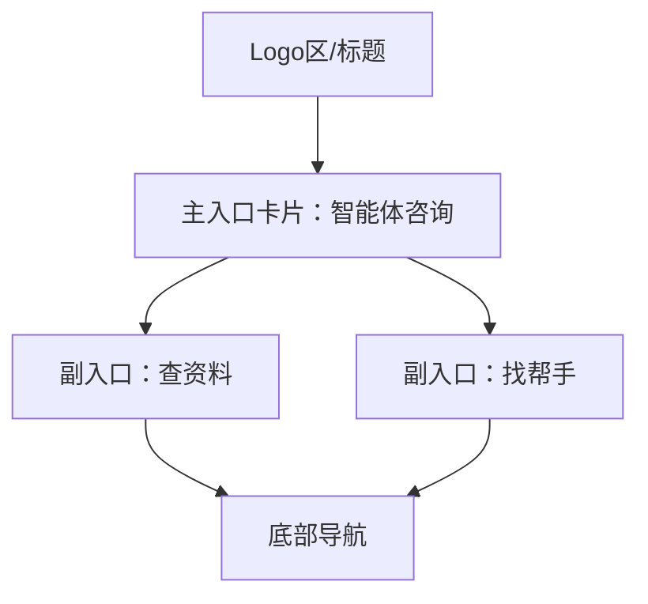

# 首页制作与导航 研究报告

## 版本记录

| 日期 | 版本 | 修改内容 | 修改原因 |
|---|---|---|---|
| 2026-01-12 | v1.0 | 初始设计 | 无 |
| 2026-01-12 | v1.1 | 融合页面设计文档，细化布局与交互 | 依据《首页-页面设计.md》 |

## 研究问题

实现“首页”的制作与导航。


## 发现摘要

- 首页设计采用“Logo区+主入口卡片+副入口卡片+底部导航”分区结构，强调主入口（智能体咨询）与常用功能的快速访问。
- 布局与交互细节高度响应移动端优先，兼容 PC，注重无障碍、对比度与触控体验。
- 组件状态（Hover、Active、Disabled、Focus）与动效有明确规范，提升可用性与反馈。
- 路由跳转需配合动画（如滑入），并处理无历史栈返回等边界。
- 空态、加载态、错误与成功反馈均有标准视觉与交互指引。

## 相关文件清单

|文件路径|作用说明|关键行号|
|---|---|---|
|src/pages/home/ | 首页页面主目录 | 全部 |
|src/layouts/HomeLayout.jsx | 首页整体布局 | 全部 |
|src/components/Header/index.jsx | 顶部导航栏组件 | 全部 |
|src/components/BottomNav/index.jsx | 底部导航栏组件 | 全部 |
|src/components/Card/index.jsx | 首页卡片组件 | 全部 |
|src/router/ | 路由配置 | 全部 |


## 当前实现分析

- 首页页面代码位于 `src/pages/home/`，主视图分为：
  1. **Logo区**（顶部40%）：品牌Logo、主标题、副标题，纯展示，无交互。
  2. **主入口卡片**：突出“智能体咨询”，大卡片样式，主按钮主色填充，支持Hover/Active/Disabled/Focus等状态，点击跳转`/consultation`，需配合滑入动画。
  3. **副入口卡片**：查资料、找帮手，样式为小卡片，移动端并排，PC端右侧垂直堆叠，点击分别跳转`/knowledge`、`/community`。
  4. **底部导航**：固定于底部，支持首页/个人中心切换，主色高亮激活，安全区适配。
- 布局采用移动端优先，PC下内容区居中、横向分区，主副入口分明。
- 组件样式与状态严格遵循设计规范，圆角、阴影、色彩、对比度、无障碍均有明确要求。
- 路由配置在 `src/router/`，首页为 `/`，其余入口卡片跳转对应页面，需处理无历史栈返回兜底。
- 空态、加载态、错误、成功反馈均有标准视觉与交互（如加载Spinner、空插图、Toast等）。


### 核心流程



1. 用户访问 `/`，渲染首页：Logo区（顶部）、主入口卡片（中部）、副入口卡片（下部）、底部导航。
2. 点击主入口卡片，跳转 `/consultation`，动画滑入。
3. 点击副入口卡片，跳转 `/knowledge` 或 `/community`，同样动画。
4. 底部导航切换首页/个人中心，始终固定底部，适配安全区。
5. 各卡片支持Hover/Active/Disabled/Focus等状态，移动端Tap反馈，PC端Hover/Tooltip。
6. 空态/加载态/错误/成功反馈按设计规范展示。


### 关键代码片段

- 路由配置（示例）：

```jsx
// src/router/index.jsx
<Route path="/" element={<HomeLayout />} />
<Route path="/consultation" element={<ConsultationPage />} />
<Route path="/knowledge" element={<KnowledgePage />} />
<Route path="/community" element={<CommunityPage />} />
```

- 首页布局引用组件（伪代码）：

```jsx
// src/layouts/HomeLayout.jsx
import Header from '../components/Header';
import MainCard from '../components/Card/MainCard';
import SubCard from '../components/Card/SubCard';
import BottomNav from '../components/BottomNav';

function HomeLayout() {
  return (
    <div className="home-layout">
      <Header />
      <div className="main-content">
        <MainCard />
        <div className="sub-cards">
          <SubCard type="knowledge" />
          <SubCard type="community" />
        </div>
      </div>
      <BottomNav />
    </div>
  );
}
```


## 架构洞察

- 组件分区明确（Logo区/主卡/副卡/底部导航），便于独立开发与维护。
- 移动端优先设计，响应式布局兼容PC，提升适配性。
- 组件状态与动效标准化，提升交互一致性与可用性。
- 路由与动画解耦，便于后续扩展页面与交互。
- 无障碍与对比度规范提升可访问性。


## 潜在风险和边缘情况

- 路由配置变更或动画实现不一致，可能影响导航体验。
- 组件依赖或样式未按设计规范实现，影响品牌一致性。
- 移动端安全区、触控目标、无障碍未覆盖，影响部分用户体验。
- 空态、加载态、错误反馈未实现，影响极端场景下的可用性。


## 开放问题与结论

1. **入口卡片的文案与图标**：由前端开发者生成和选择，需结合品牌风格与设计规范，主入口建议“智能体咨询”，副入口建议“查资料”“找帮手”，图标风格低饱和、圆角柔和。
2. **动态数据**：首页主内容区无需支持动态数据，所有内容为静态展示。
3. **跳转与返回逻辑**：点击主/副入口卡片，直接跳转至对应页面（/consultation、/knowledge、/community）；在次级页面点击返回按钮，返回上一页（浏览器历史栈）。
4. **空态/加载态/错误反馈**：当前未实现，建议在页面结构中预留占位，后续可根据需求补充具体实现。

（本轮已关闭全部开放问题，后续如有新需求可再补充。）


## 参考资料

- docs/page-designs/首页-页面设计.md
- docs/“心青年”智能体平台-前端界面设计方案.md
- docs/“心青年”智能体平台-前端-项目结构.md
- src/components/ 目录下各组件 README.md
