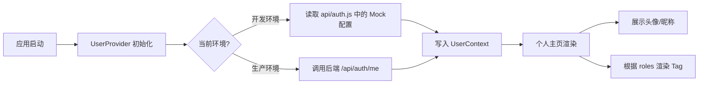

# 个人主页 研究报告

## 版本记录

| 日期 | 版本 | 修改内容 | 修改原因 |
|---|---|---|---|
| 2026-01-13 | v1.0 | 初始设计 | 无 |
| 2026-01-13 | v1.1 | 全面更新实现分析 | 代码库变更 |
| 2026-01-13 | v1.2 | 在 v1.1 基础上重构 | 根据用户反馈明确个人信息卡展示与 Mock 方案 |

## 研究问题

- 个人信息卡包含哪些关键信息以及如何展示？
- 如何在开发阶段灵活切换用户角色？
- 完整的用户状态与权限控制流程是什么？

## 发现摘要

- **个人信息卡**：需展示头像、昵称及身份标签（Tag）。
- **Mock 方案**：在 `src/api/auth.js` 中通过修改代码（`process.env.NODE_ENV` 判断）来硬编码返回不同角色的用户对象。
- **角色定义**：最高权限用户（如 Super Admin）即拥有所有角色数组。
- **权限实现**：沿用 Context + Hook 模式，前端仅做展示控制，核心鉴权在通过 Cookie 交互的后端。

## 相关文件清单

|文件路径|作用说明|关键行号|
|---|---|---|
|src/pages/my/index.jsx|个人主页，负责 UI 展示与登出|全文件|
|src/api/auth.js|鉴权接口，**此处进行 Mock 数据注入**|getCurrentUser|
|src/store/UserContext.jsx|全局状态管理|checkPermission|
|src/components/SectionContainer/index.jsx|容器组件，用于包裹信息卡| - |

## 当前实现分析

### 1. 个人信息卡设计
个人信息卡位于个人中心页面顶部，展示当前登录用户的核心身份信息。
- **布局**：使用 Flex 布局。
- **元素**：
  - **头像**：左侧展示，圆形图片。
  - **信息区**：右侧。包含第一行的**昵称**（加粗）和第二行的**身份标签组**。
  - **身份标签**：遍历 `user.roles`，渲染为 Tag 组件或样式化的 span。

### 2. 开发环境 Mock 方案
为满足“开发者直接修改代码切换角色”的需求，在 `src/api/auth.js` 的 `getCurrentUser` 方法中拦截请求。
- **机制**：检测 `process.env.NODE_ENV === 'development'`。
- **操作**：开发者手动注释或取消注释特定的 `mockUser` 对象，来模拟不同身份（如志愿者、专家、管理员等）。
- **最高权限**：设置 `roles: ['admin', 'expert', 'volunteer', 'family']` 即可获得所有视图权限。

### 核心流程



### 关键代码片段

#### 1. 个人主页实现 (`src/pages/my/index.jsx`)

```jsx
// src/pages/my/index.jsx
import React from 'react';
import { useNavigate } from 'react-router-dom';
import { Tag } from 'antd-mobile'; // 若未安装 antd-mobile，可用简单 div 样式替代
import { useUser } from '../../store/useUser';
import HomeLayout from '../../layouts/HomeLayout';
import SectionContainer from '../../components/SectionContainer';
import LogoutButton from './LogoutButton';
// ... import icons

const MyPage = () => {
  const navigate = useNavigate();
  const { user } = useUser(); // 获取全局用户状态

  // 1. 个人信息卡渲染
  const infoCard = (
    <SectionContainer className="my-info-card">
      <div style={{ display: 'flex', alignItems: 'center', gap: '16px', padding: '12px 0' }}>
        {/* 头像 */}
        <div className="avatar" style={{ width: 64, height: 64, borderRadius: '50%', backgroundColor: '#f0f0f0', overflow: 'hidden' }}>
           {/* 若无头像字段，提供默认图 */}
           
        </div>
        {/* 信息区 */}
        <div className="info">
          <div className="nickname" style={{ fontSize: '18px', fontWeight: 'bold', marginBottom: '8px', color: '#333' }}>
            {user?.username || '未登录用户'}
          </div>
          <div className="roles" style={{ display: 'flex', gap: '8px', flexWrap: 'wrap' }}>
             {/* 身份标签展示 */}
             {user?.roles && user.roles.length > 0 ? (
               user.roles.map(role => (
                 <span key={role} style={{ 
                   fontSize: '10px', 
                   padding: '2px 8px', 
                   backgroundColor: '#e6f7ff', 
                   color: '#1890ff', 
                   borderRadius: '4px',
                   border: '1px solid #91d5ff'
                 }}>
                   {role}
                 </span>
               ))
             ) : (
               <span style={{ fontSize: '12px', color: '#999' }}>暂无身份</span>
             )}
          </div>
        </div>
      </div>
    </SectionContainer>
  );

  // ... (其余部分保持不变)
};
```

#### 2. 鉴权 API Mock 配置 (`src/api/auth.js`)

```javascript
// src/api/auth.js
const API_BASE = '/api/auth';

export async function getCurrentUser() {
  // --- 开发环境 Mock 开关 ---
  if (process.env.NODE_ENV === 'development') {
    // 开发者在此处修改 Mock 数据以切换身份
    // 场景1：最高权限用户 (所有角色)
    return {
      user: {
        id: 1,
        username: 'Dev_SuperAdmin',
        // 包含所有角色：管理员、专家、志愿者、家属
        roles: ['admin', 'expert', 'volunteer', 'family'], 
        avatar: 'https://api.dicebear.com/7.x/miniavs/svg?seed=1',
        email: 'dev@monitor.com'
      }
    };
  }
  // -------------------------

  const res = await fetch(`${API_BASE}/me`, {
    credentials: 'include',
  });
  if (!res.ok) throw new Error('未登录');
  return await res.json();
}
```

## 架构洞察

- **灵活的 Mock 机制**：虽然硬编码看起来原始，但在单人开发或小团队中，直接修改代码是最快、最直观的“配置”方式，避免了复杂的 Mock UI 开发成本。
- **角色标识标准化**：前端通过 Tag 显式展示角色，有助于开发人员快速确认当前账号权限，避免“为什么我按钮不显示”的困惑。
- **Context 为唯一真值**：UI 层的展示完全响应 Context 中的数据，切换 mock 并在代码中保存（热重载）后，页面应立即刷新状态。

## 潜在风险与边缘情况

- **误提交 Mock 代码**：必须在代码评审（Commit Lens）环节重点检查 `src/api/auth.js`，防止将 Mock 数据提交到生产环境。
- **标签溢出**：如果用户拥有过多角色，移动端界面可能出现 Tag 换行或溢出，需注意 Flex 布局的 wrap 属性。

## 开放问题

无（已确认为不需要复杂的动态权限控制，只需满足当前角色展示与开发切换需求）。

## 参考资料

- [docs/tasks/05-个人中心/2026-01-13_通过context实现用户身份控制_研究报告.md](../05-个人身份控制/2026-01-13_通过context实现用户身份控制_研究报告.md)

