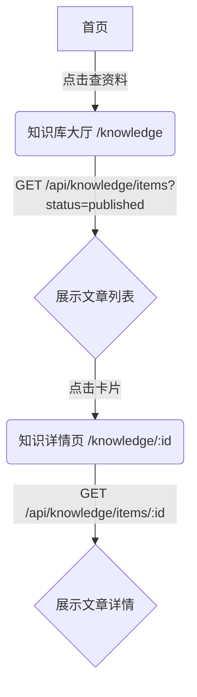
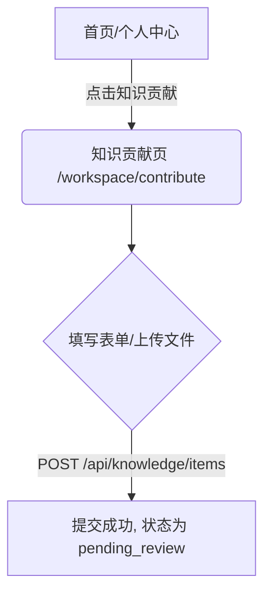
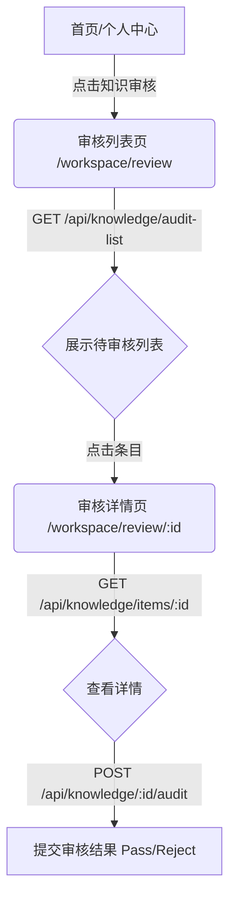

# 知识库功能实现 研究报告

## 版本记录

| 日期 | 版本 | 修改内容 | 修改原因 |
|---|---|---|---|
| 2026-02-23 | v1.0 | 初始设计 | 规划知识库相关页面与功能的实现路径 |
| 2026-02-23 | v1.1 | 需求澄清 | 明确分类数据来源、草稿保存机制及驳回编辑流程 |

## 研究问题

参考 docs 中的相关文档，实现知识库相关的页面和相应功能（包括知识库大厅、知识详情页、知识贡献、知识审核列表、审核详情），API 接口规范参考 `docs\“心青年”智能体平台-数据模型与 API 设计.md` 和 `openapi.json`。

## 发现摘要

1. **路由与页面缺失**：目前仅有 `src/pages/knowledge/index.jsx` 的占位文件，缺失详情页及 `workspace` 下的贡献与审核相关页面，需在 `App.jsx` 中补充路由。
2. **API 接口已就绪**：`openapi.json` 中已完整定义了 `/api/knowledge/*` 相关的 CRUD、审核及上传接口，需在前端新建 `src/api/knowledge.js` 进行封装。
3. **权限分层明确**：知识浏览面向所有用户；知识贡献面向志愿者和专家；知识审核仅限专家和管理员。前端需结合 `UserContext` 进行路由或组件级别的权限拦截。
4. **UI 规范清晰**：`docs/page-designs/` 中已提供大厅和详情页的设计规范，需复用现有的 `Header`、`Card` 等组件，并注意移动端优先的响应式布局。

## 相关文件清单

| 文件路径 | 作用说明 | 关键行号/状态 |
|---|---|---|
| `src/App.jsx` | 应用路由配置 | 需新增知识库详情及工作台相关路由 |
| `src/api/knowledge.js` | 知识库 API 请求封装 | **需新建** |
| `src/pages/knowledge/index.jsx` | 知识库大厅页面 | L3-L10 (当前为占位，需重构) |
| `src/pages/knowledge/detail.jsx` | 知识详情页 | **需新建** |
| `src/pages/workspace/contribute.jsx` | 知识贡献页面 | **需新建** |
| `src/pages/workspace/review.jsx` | 知识审核列表页面 | **需新建** |
| `src/pages/workspace/reviewDetail.jsx` | 审核详情页面 | **需新建** |

## 当前实现分析

目前前端代码库中关于知识库的实现几乎为空白。`src/pages/knowledge/index.jsx` 仅返回一个简单的 `<div>` 占位符。`src/pages/workspace/` 目录尚未创建。

根据 `docs/“心青年”智能体平台-前端界面设计方案.md`，知识库大厅和详情页属于次级页面，需要包含带有返回按钮的 `Header`。统一服务中心（包含贡献和审核）的页面也属于次级页面，路径前缀为 `/workspace`。

### 核心流程

#### 1. 知识浏览流程 (C端)


#### 2. 知识贡献流程 (志愿者/专家)


#### 3. 知识审核流程 (专家/管理员)


### 关键代码片段

**1. API 封装 (`src/api/knowledge.js` 预想结构)**
```javascript
import apiClient from '../config/apiConfig';

export const knowledgeApi = {
  // 获取知识列表 (支持分页和状态过滤)
  getItems: (params) => apiClient.get('/api/knowledge/items', { params }),
  
  // 获取知识详情
  getItemById: (id) => apiClient.get(`/api/knowledge/items/${id}`),
  
  // 创建知识条目
  createItem: (data) => apiClient.post('/api/knowledge/items', data),
  
  // 获取待审核列表
  getAuditList: (params) => apiClient.get('/api/knowledge/audit-list', { params }),
  
  // 提交审核结果
  auditItem: (id, data) => apiClient.post(`/api/knowledge/${id}/audit`, data),
  
  // 上传文件自动切片
  uploadFile: (formData) => apiClient.post('/api/knowledge/upload', formData, {
    headers: { 'Content-Type': 'multipart/form-data' }
  })
};
```

**2. 路由配置补充 (`src/App.jsx`)**
```jsx
// 引入新页面
const KnowledgeDetailPage = lazy(() => import('./pages/knowledge/detail.jsx'));
const ContributePage = lazy(() => import('./pages/workspace/contribute.jsx'));
const ReviewPage = lazy(() => import('./pages/workspace/review.jsx'));
const ReviewDetailPage = lazy(() => import('./pages/workspace/reviewDetail.jsx'));

// 在 <Routes> 中添加
<Route path="/knowledge/:id" element={<KnowledgeDetailPage />} />
<Route path="/workspace/contribute" element={<ContributePage />} />
<Route path="/workspace/review" element={<ReviewPage />} />
<Route path="/workspace/review/:id" element={<ReviewDetailPage />} />
```

## 架构洞察

- **组件复用**：知识库大厅的列表项、审核列表的列表项可以高度复用 `src/components/Card` 组件。顶部导航栏必须统一使用 `src/components/Header` 以保持次级页面的一致性。
- **富文本/Markdown 渲染**：知识详情页 (`content` 字段) 极大概率包含 Markdown 格式文本，需要引入如 `react-markdown` 等库进行安全渲染，并配合 `Tailwind Typography` 或自定义 CSS 保证阅读体验。
- **状态管理与分页**：列表页（大厅和审核列表）需要处理 `skip` 和 `limit` 参数，建议封装一个通用的上拉加载 Hook 或使用现有的列表组件模式。

## 潜在风险和边缘情况

- **权限越权访问**：前端必须在 `/workspace/review` 等路由组件内检查 `UserContext` 中的角色信息，若非 `Expert` 或 `Admin` 应重定向至首页或显示无权限提示。
- **大文本渲染性能**：如果知识条目内容极长，Markdown 渲染可能会造成页面卡顿，需注意组件的 Memoization。
- **文件上传交互**：`/api/knowledge/upload` 接口的具体行为（是直接生成条目还是仅返回解析后的文本供用户二次编辑）需要在开发贡献页面时与后端实际表现对齐。

## 需求澄清 (2026-02-23)

1. **分类数据来源**：知识分类由前端根据从后端获取的所有数据所具有的 `category` 字段动态生成，无需后端提供单独的分类接口。
2. **草稿保存机制**：需要实现本地草稿保存（如使用 LocalStorage），以防用户在知识贡献页面意外退出导致长文本丢失。
3. **审核驳回后的编辑**：被驳回的知识条目，作者重新编辑提交时，复用 `/workspace/contribute` 页面并传入 `id` 进行处理。

## 开放问题

- **文件上传交互**：`/api/knowledge/upload` 接口的具体行为（是直接生成条目还是仅返回解析后的文本供用户二次编辑）需要在开发贡献页面时与后端实际表现对齐。