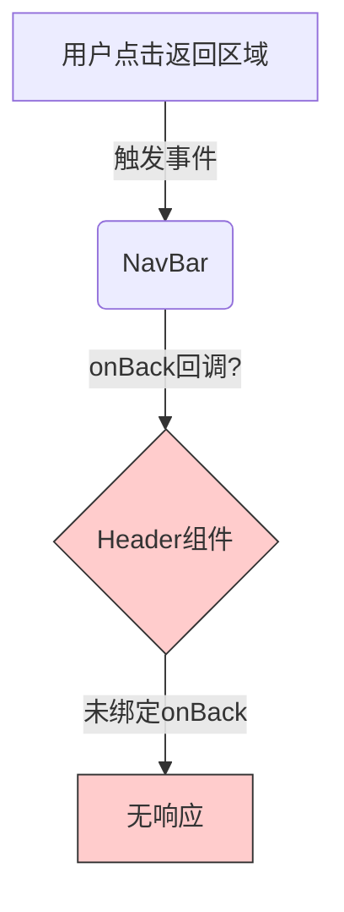

# 次级页面返回按钮失效问题研究

## 版本记录

| 日期 | 版本 | 修改内容 | 修改原因 |
|---|---|---|---|
| 2026-01-15 | v1.0 | 初始分析 | 用户反馈次级页面返回按钮无法使用 |

## 研究问题

次级页面的导航栏（尤其是“个人信息”页面）的返回按钮无法返回上一页。

## 发现摘要

导航栏的返回功能失效是由于组件间的 props 传递断裂导致的。
具体来说，`SubLayout` 组件试图通过 `back` 属性传递返回回调给 `Header` 组件，但 `Header` 组件并未接收该 `back` 属性，也未将任何回调绑定到 `antd-mobile` `NavBar` 组件的 `onBack` 事件上。

## 相关文件清单

| 文件路径 | 作用说明 | 关键行号 |
|---|---|---|
| [src/components/Header/index.jsx](src/components/Header/index.jsx) | 头部导航组件，封装了 NavBar | L14-L35 |
| [src/layouts/SubLayout.jsx](src/layouts/SubLayout.jsx) | 次级页面布局，包含 Header | L14, L19 |
| [src/pages/my/PersonalInfo.jsx](src/pages/my/PersonalInfo.jsx) | 个人信息页面，使用了 SubLayout | L10 |

## 当前实现分析

### 1. `SubLayout.jsx` 的实现

在 `src/layouts/SubLayout.jsx` 中，`SubLayout` 组件定义了 `handleBack` 处理函数，并将其作为 `back` 属性传递给了 `Header`。

```jsx
// src/layouts/SubLayout.jsx L13-L20
const handleBack = onBack || (() => navigate(-1));
return (
  <div className="yh-sub-layout" ...>
    <Header
      title={title}
      subtitle={subtitle}
      showBack
      rightActions={rightActions}
      back={handleBack} {/* 问题点：这里使用了 'back' 属性名 */}
    />
    <main ...>{children}</main>
  </div>
);
```

### 2. `Header/index.jsx` 的实现

在 `src/components/Header/index.jsx` 中，`Header` 组件的 props 解构中并未包含 `back` 或 `onBack`，且 `NavBar` 组件没有绑定 `onBack` 事件。

```jsx
// src/components/Header/index.jsx L14-L26
const Header = ({ title, subtitle, showBack = false, rightActions, children }) => { // 只有 title, subtitle, showBack, rightActions, children
  return (
    <header className="yh-header">
      <NavBar
        back={showBack ? '返回' : null} // 这里只设置了显示的文字
        right={rightActions}
        // ...
      >
        {/* ... */}
      </NavBar>
    </header>
  );
};
```

`antd-mobile` 的 `NavBar` 组件需要 `onBack` 属性来响应左侧点击事件。

## 核心流程缺陷



## 修复建议

### 1. 修改 `Header` 组件

使其接收 `onBack` 属性，并传递给 `NavBar`。

```jsx
// src/components/Header/index.jsx

// 1. 在参数中添加 onBack
const Header = ({ title, subtitle, showBack = false, rightActions, children, onBack }) => {
  return (
    <header className="yh-header">
      <NavBar
        back={showBack ? '返回' : null}
        onBack={onBack} // 2. 绑定事件
        right={rightActions}
        // ...
      >
```

### 2. 修改 `SubLayout` 组件

将传递给 `Header` 的属性名从 `back` 改为 `onBack` (为了语义清晰，且匹配 NavBar 的 API)。

```jsx
// src/layouts/SubLayout.jsx

<Header
  title={title}
  subtitle={subtitle}
  showBack
  rightActions={rightActions}
  onBack={handleBack} // 修改属性名为 onBack
/>
```

## 潜在风险

- 需要确保所有使用 `Header` 组件的地方（除了 `SubLayout` 还有没有其他地方手动调用？）都知晓这一改动，但由于 `onBack` 是可选的，旧代码不会报错，只是依然没有返回功能（如果它们原本期望有的话）。
- 当前只把 `SubLayout` 作为次级页面的主要入口，修复这里应该能解决大部分问题。

## 开放问题

- 无。

