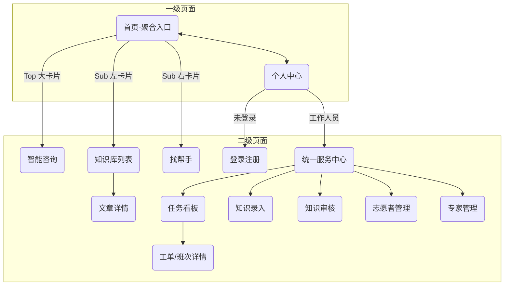

# “心青年”智能体平台 - H5 前端界面设计方案

## 版本记录
| 日期 | 修改类型 | 修改摘要 |
|---|---|---|
| 2026-01-11 | 新建 | 初始版本创建 |
| 2026-01-11 | 更新 | 1. 新增个人中心、志愿者管理、专家管理页面设计； 2. 补充 Mermaid 站点导航图。 |
| 2026-01-11 | 更新 | **交互架构与首页重构**： 1. 确立“一级/二级页面”分层导航体系； 2. 首页视觉升级：取消顶部导航，采用“Logo+Slogan”与“1+2”功能卡片布局； 3. 将“智能咨询”独立为二级页面。 |
| 2026-01-11 | 更新 | **页面详情深度细化**： 1. 细化知识库列表与详情页交互； 2. 拆分“任务看板”为线上/线下双视图； 3. 完善知识贡献表单与审核台操作流程； 4. 补充注册页面的分角色流程。 |

## 1. 设计概览

### 1.1 设计理念
基于“心青年”项目的特殊服务对象（孤独症家庭、志愿者、专家），设计遵循以下核心原则：
- **情感化治愈 (Healing)**：界面应传递希望与平静，避免使用产生焦虑的高饱和度色彩。
- **低认知负担 (Cognitive Ease)**：为处于高压力状态下的家属提供极简的操作路径，核心功能“一键直达”。
- **无障碍友好 (Accessibility)**：考虑到用户可能存在的视觉或操作障碍，采用大触控区、高对比度文字与语音交互优先策略。

### 1.2 视觉规范
- **风格关键词**：温暖、信赖、极简、包容。
- **色彩体系**：
    - **主色 (Primary)**：`#4A90E2` (静谧蓝) - 用于主按钮、激活状态，传递专业与冷静。
    - **辅色 (Secondary)**：`#F5A623` (暖阳橙) - 用于重要提示、志愿者服务相关，传递活力与温情。
    - **背景色**：`#F7F8FA` (云朵灰) - 用于页面底色，减少视觉疲劳。
    - **功能色**：`#FF5B5B` (紧急/错误)、`#52C41A` (成功/在线)。
- **排版 (Typography)**：
    - 字体：系统默认无衬线字体 (San Francisco / PingFang SC / Roboto)。
    - 字号：正文不小于 16px，辅助文字不小于 14px，标题强调层级感。
- **图标风格**：圆润线面结合图标，亲和力强，避免尖锐棱角。

### 1.3 交互范式 (H5 Mobile)
- **导航模式**：分为一级与二级页面。
    - **一级页面**：底部只有 [首页] [个人中心] 两个标签，顶部有核心标题。
    - **二级页面**：顶部左侧有返回箭头，中间有标题，无底部导航栏。
- **操作习惯**：单手操作优化，关键按钮置于屏幕下半部分（拇指热区）。
- **反馈机制**：操作即时反馈（Toast/Loading/Haptic），特别是AI生成过程中的状态提示。

---

## 2. 页面清单

### A. 一级页面 (Root Level - 底部导航)
1.  **首页 (Home)** - 核心功能聚合入口（1+2 布局）。
2.  **个人中心 (Profile)** - 身份管理、历史记录、进入服务中心入口。

### B. 二级页面 (Sub Level - 顶部返回)
**核心功能：**

1.  **智能咨询 (Chat)** - (独立) RAG 问答对话界面。
2.  **知识库列表 (Wiki/List)** - 分类与检索。
3.  **知识库详情 (Wiki/Detail)** - 文章阅读。
4.  **找帮手/人员墙 (Public/Wall)** - 专家志愿者展示。

**服务中心 (Service Center - 仅工作人员)：**

5.  **统一服务中心 (Dashboard)** - 工作人员的“首页”。
6.  **任务看板 (Task/Board)** - 线上工单与线下班次。
7.  **任务/工单详情 (Task/Detail)** - 处理界面。
8.  **知识贡献 (Contrib/Form)** - 录入表单。
9.  **知识审核 (Review/List)** - 审核列表与操作。
10. **志愿者管理 (Admin/Vol)** - 列表与排班。
11. **专家管理 (Admin/Exp)** - 资质审核。

**认证与基础：**

12. **登录/注册 (Auth)** - 手机号/验证码登录。
13. **线下活动报名 (Task/OfflineShift)** - 班次详情与报名。

---

## 3. 站点地图示例（页面链接关系）

### 3.1 Mermaid 示意图

### 3.2 结构化链接关系
- **一级页面 (Bottom Tabs)**: `Home`, `Profile`
- **Home (1+2 Grid)** -> `Chat` (Main), `WikiList` (Sub), `HelperWall` (Sub)
- **Profile (Actions)** -> `Login`, `Dashboard` (Button)
- **Dashboard (Grid)** -> `TaskBoard`, `Contrib`, `Review`, `VolManage`, `ExpManage`

---

## 4. 页面详述

### 4.1 一级页面：首页 (Page_Home)
**ID**: `P_Home_001`
**功能映射**: 核心功能聚合入口。

- **布局 (Layout)**：
    - **Header Area (中上部)**：
        - 无顶部导航栏。
        - 居中展示品牌 Logo（大尺寸）。
        - 程序名称艺术字：“心青年”智能体平台。
        - 治愈系 Slogan：“让爱不孤单，让心有依靠”。
    - **Action Grid (中下部 1+2 布局)**：
        - **Main Card (全宽)**：**[🤖 智能体咨询]** - 视觉最显著，配 AI 助手/对话插画，文案“24小时专业问答，即刻解惑”。点击跳转 `Page_Chat_001`。
        - **Sub Card (左半)**：**[📚 查资料]** - 配书本/文档图标，背景色稍淡。点击跳转 `P_Wiki_List`。
        - **Sub Card (右半)**：**[👥 找帮手]** - 配握手/爱心图标，背景色稍淡。点击跳转 `P_Public_Wall`。
    - **Bottom Nav**：[首页(Active)] [个人中心]。

- **交互逻辑**：
    - 页面加载时 Header Area 可以有轻微的淡入动画。
    - 点击任意卡片触发跳转。

### 4.2 二级页面：智能咨询 (Page_Home_Chat)
**ID**: `P_Chat_001` (二级页面)
**功能映射**: RAG 智能咨询引擎、语音转文字 input。

- **布局 (Layout)**：
    - **Header**：[< 返回] [智能咨询] (右侧可放清空/新对话图标)。
    - **Body**：消息流滚动区域。
    - **Footer**：固定在底部的输入操作区。

- **视觉细节**：
    - **AI 气泡**：左侧显示，背景色 `#FFFFFF`，带有品牌 Logo 头像。回答内容结构化展示（Markdown 渲染），关键信息加粗。
    - **用户气泡**：右侧显示，背景色 `#E6F7FF` (极浅蓝)。
    - **引用来源**：AI 回答底部以卡片或折叠标签形式展示。
    - **兜底提示**：若 AI 无法回答，直接在气泡下显示“转人工咨询”按钮。

- **交互逻辑**：
    - **语音输入**：输入框右侧设置显著的“麦克风”图标，长按录音，松开转文字。
    - **思考状态**：发送后，界面展示“正在查阅知识库...”的动态 Loading。

### 4.3 一级页面：个人中心 (Page_Profile)
**ID**: `P_Profile_001`
**功能映射**: 资料管理、身份入口。

- **布局**：
    - **Header Card**：未登录显示[去登录]，已登录显示头像与角色。
    - **Body List**：
        - [我的咨询历史] (家属)
        - [我的收藏] (知识库文章)
        - **[进入统一服务中心]** (仅志愿者/专家/管理员可见，高亮样式)
        - [设置] (退出登录/隐私)
    - **Bottom Nav**：[首页] [个人中心(Active)]

### 4.3 二级页面：知识库可视化 (Page_Wiki_List)
**ID**: `P_Wiki_001` (二级页面)
**功能映射**: 知识库查阅、分类导航、全文检索。

- **Header**：[< 返回] [知识库]
- **Body Layout**：
    - **Search Bar (Sticky)**：顶部吸附的搜索框，Placeholder：“搜索康复指南、干预技巧...”。
        - **交互**：输入时展示“历史搜索”；回车后展示结果列表。
    - **Filter Tabs**：[全部] [情绪干预] [生活自理] [社交融合] [就业指导] (支持横向滚动)。
    - **Content List**：
        - **卡片样式**：
            - **标题**：加粗，限制 2 行。
            - **摘要**：灰色小字，限制 3 行，显示文章核心内容的预览。
            - **底部信息**：[标签Tag] · 来源：指南名称 · 专家审核认证图标(Verified Badge)。
- **交互**：
    - 点击卡片跳转至 `P_Wiki_Detail`。
    - 上拉加载更多。

### 4.3.1 二级页面：知识库详情 (Page_Wiki_Detail)
**ID**: `P_Wiki_Detail`
**功能映射**: 阅读完整文章、查看来源。

- **Layout**：
    - **Cover/Header**：文章标题（大字号），发布日期，贡献者/审核专家姓名。
    - **Content Area**：Markdown 渲染区域，支持富文本（加粗、列表、图片）。
    - **Reference Card (底部)**：来源文档链接（如：“XXX康复操作手册.pdf - 第3章”）。
- **交互**：
    - 收藏按钮（右上角）。
    - 底部悬浮：“相关推荐”或“基于此内容提问”按钮（跳转 Chat 并带入上下文）。

### 4.4 二级页面：统一服务中心 (Page_Dashboard)
**ID**: `S_Dash_001` (二级页面)
**功能映射**: 工作人员（志愿者/专家/管理员）的专属工作台(Portal)。

- **Header**：[< 返回] [统一服务中心]
- **Status Bar (顶部)**：
    - **当前状态**：[🟢 在线] (点击可切换为 🔴 忙碌 / ⚫ 离线)。
    - **文案提示**：根据状态显示不同提示（在线：“可随时接收新任务”；忙碌：“暂停派单”）。
- **Role-Based Grid (宫格菜单)**：
    - **通用模块**：
        - **[📋 任务看板]**：带有红色角标（待处理数）。
        - **[📝 知识贡献]**：录入新知识。
    - **专家/管理员限定**：
        - **[⚖️ 知识审核]**：审核队列。
    - **管理员限定**：
        - **[👥 志愿者管理]**。
        - **[🎓 专家管理]**。
        - **[📊 数据报表]**。

### 4.5 二级页面：任务看板 (Page_Task_Board)
**ID**: `S_Task_001` (二级页面)
**功能映射**: 查看并处理“线上工单”与“线下班次”。

- **Header**：[< 返回] [任务看板]
- **Segmented Control (分段控制器)**：[线上咨询工单] [线下志愿活动]
- **View - 线上咨询工单**：
    - **Filter**：[待认领] [我的任务] [已解决]。
    - **Ticket Card**：
        - **Header**：[标签：自伤] [紧急度：高(红色)] [发布时间：10分钟前]。
        - **Body**：用户提问摘要（“孩子一直在撞头...”）。
        - **AI Status**：显示“AI已回答”或“AI无法回答”。
        - **Action**：[查看详情]。
- **View - 线下志愿活动**：
    - **Filter**：[报名中] [我的报名] [历史]。
    - **Shift Card**：
        - **Date/Time**：大字号显示日期与时间。
        - **Location**：活动地点。
        - **Slots**：人员进度条（例如：已报 3/5 人）。
        - **Status**：[可报名] / [待审核] / [已通过]。
        - **Action**：[立即报名] (若未满) / [查看详情]。

### 4.6 二级页面：任务/工单详情 (Page_Task_Detail)
**ID**: `S_Task_Detail`
**功能映射**: 具体的任务执行界面。

- **场景 A：线上咨询工单详情**
    - **Info Area**：用户画像简述（如“5岁男童家长”），问题上下文。
    - **Chat History**：只读视图，显示 [User提问] -> [RAG回答] -> [User追问]...
    - **Action Bar (底部)**：
        - **状态：未认领**
            - **志愿者**：[申请认领] (点击后状态变更为“审核中”)。
            - **专家**：[⚡ 立即接手] (高亮按钮，点击直接进入处理状态，跳过审核)。
        - **状态：处理中 (我的任务)**
            - **Input**：回复输入框，支持发送图片/文件。
            - **Func**：[完结工单] [转交专家]。
            
- **场景 B：线下活动详情**
    - **Map**：嵌入小地图显示地点。
    - **Rich Text**：活动详细说明、注意事项。
    - **Roster**：已报名志愿者列表（仅管理员/领队可见）。
    - **Action Bar**：
        - [提交报名] (填写备注后提交)。
        - [取消/请假] (若已报名)。

### 4.7 二级页面：知识贡献与审核
**ID**: `S_Contrib_Form` / `S_Review_List` / `S_Review_Detail`

#### 4.7.1 知识贡献页 (Page_Contrib_Form)
- **表单项**：
    1.  **标题** (Input)：清晰的知识点名称。
    2.  **摘要** (Textarea)：用于搜索展示。
    3.  **核心内容** (Markdown Editor)：
        - 提供基础工具栏（H1/H2, 粗体, 列表）。
        - 支持粘贴。
    4.  **标签** (Tag Selector)：多选（如：#情绪 #饮食）。
    5.  **原始文档** (Upload, 可选)：支持上传 PDF/Word 作为依据。
- **Action**：[保存草稿] [提交审核]。

#### 4.7.2 知识审核列表 (Page_Review_List)
- **列表项**：标题、提交人（头像+昵称）、提交时间、状态（待审核）。
- **交互**：点击进入审核详情。

#### 4.7.3 审核详情 (Page_Review_Detail) -- 专家/管理员
- **Diff View / Content View**：展示提交的内容。
- **Feedback Area**：
    - **[驳回]**：弹出模态框，必填“修改意见”。
    - **[直接修订]**：进入编辑模式修改内容。
    - **[通过]**：内容由“待审核”转为“已发布”，即刻入库。

### 4.8 二级页面：人员管理 (Admin Only)
**ID**: `S_Admin_Vol` / `S_Admin_Exp`

- **志愿者管理 (List)**：
    - **列表显示**：姓名、当前状态标记 (在线/忙碌/离线)、本月服务时长。
    - **Filters**：[待审核注册] [正式志愿者] [封禁]。
    - **详情页动作**：[排班表] [通过注册] [封禁账号]。
- **专家管理 (List)**：
    - **核心关注**：资质审核。
    - **详情页**：
        - **资质证明**：点击可查看大图（PDF/图片）。
        - **擅长领域**：Tag 展示。
        - **Action**：[认证通过] [驳回资料]。

### 4.9 二级页面：找帮手 (Page_Public_Wall)
**ID**: `P_Public_001` (二级页面)
- **Header**：[< 返回] [找帮手]
- **Filters**：[找专家] [找志愿者] | [按领域筛选]
- **Card List**：
    - **专家卡片**：头像、认证徽章、姓名、职称、擅长领域。
        - **隐私逻辑**：仅显示已设置 `public_visible=true` 的人员。**绝不显示手机号**。
        - **联系方式**：若邮箱公开，显示[邮件联系]图标按钮；否则仅显示简介。
    - **交互**：点击卡片可查看更详细的个人履历（但不包含私人联系方式）。

### 4.10 二级页面：登录/注册 (Page_Auth)
**ID**: `P_Auth_001`
**功能映射**: 身份鉴权入口。

- **Tab Switch**：[登录] [注册]
- **Login View**：
    - 输入：手机号 + 验证码/密码。
    - 忘记密码入口。
- **Register View**：
    - **Step 1: 角色选择** (三张大卡片)
        - **我是家属** -> (跳转极简注册)
        - **我是志愿者** -> (跳转详细表单：含服务时间偏好)
        - **我是专家** -> (跳转专业表单：含资质上传、执业编号)
    - **Step 2/3: 信息填写**
    - **Feedback**：志愿者/专家注册提交后，显示“审核中”提示页，告知会有短信/邮件通知结果。

---

## 5. 无障碍与适配说明 (Accessibility & Adaptation)

### 5.1 字体与可读性
- 支持系统级字体大小缩放 (Rem 布局)。
- 文本颜色与背景对比度至少达到 WCAG AA 标准（4.5:1），确保视力不佳者也能看清。

### 5.2 操作辅助
- **大点击区**：手机端按钮高度不低于 44px (iOS 标准)，避免误触。
- **语音辅助**：聊天页面核心功能必须支持 Screen Reader (读屏软件) 焦点访问，Label 标签清晰（例如“语音输入按钮”，而不是单纯的图标）。

### 5.3 情感化设计细节
- **Loading 动画**：使用柔和的呼吸灯效果，而不是由于系统卡顿产生的生硬转圈。
- **空状态 (Empty State)**：当没有搜索结果或任务时，使用插画（如“暂无内容，休息一下吧”）配合引导文案，减少挫败感。
