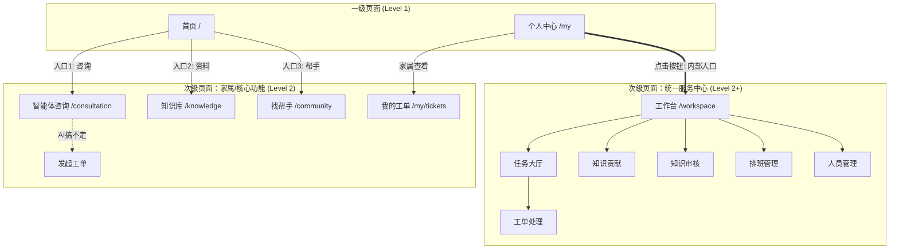

# “心青年”智能体平台-前端界面设计方案

## 版本记录
| 日期 | 版本 | 修改人 | 修改摘要 |
|---|---|---|---|
| 2026-01-11 | v1.0 | 架构师 | 初始版本创建：定义设计风格、梳理RAG咨询流与统一服务中心路由结构。 |
| 2026-01-11 | v1.1 | 架构师 | **结构重构**：定义一级/次级页面导航规则；首页采用“Logo+1+2”布局；收敛统一服务中心入口至个人中心。 |

## 1. 设计概述

### 1.1 设计理念
**“理性的温暖 (Rational Warmth)”**
针对孤独症家庭（患者家属）及专业服务者，设计需平衡“情感抚慰”与“专业效率”。
- **无障碍与低刺激**：避免高饱和度色彩和剧烈动效，为潜在的心青年用户或处于焦虑状态的家属提供视觉安抚。
- **清晰的认知负荷**：信息层级扁平化，关键操作（如“立即咨询”）零门槛触达。
- **信任感构建**：在 AI 生成内容与专家建议展示上，通过严谨的 UI 布局（引用角标、专家卡片）强化权威性。

### 1.2 风格关键词
- **Calm (静谧)**：使用低对比度、柔和的界面语言，减少焦虑。
- **Reliable (可信)**：通过结构化的数据展示（如引用来源清晰可见）建立信任。
- **Accessible (包容)**：大字体、高易读性，符合 WCAG 无障碍标准。

### 1.3 色彩系统
| 颜色用途 | 建议色值 (HEX) | 描述 |
|---|---|---|
| **主色 (Primary)** | `#4A90E2` (静谧蓝) | 用于主按钮、关键链接，传递专业与冷静。 |
| **辅助色 (Secondary)** | `#50E3C2` (疗愈绿) | 用于成功状态、正面反馈、志愿者标识。 |
| **强调色 (Accent)** | `#F5A623` (暖阳橙) | 仅用于“需注意”提示、紧急状态或暖心引导。 |
| **背景色 (Background)** | `#F4F6F8` (云雾灰) | 用于页面底色，避免纯白刺眼。 |
| **文本色 (Text)** | `#2C3E50` (深灰蓝) | 主文本色，避免纯黑，柔和阅读体验。 |

---

## 2. 页面导航与布局规范

本系统采用**双层级导航结构**，严格区分一级页面与次级页面。

### 2.1 一级页面 (Level 1 Pages)
*   **适用范围**：仅限 `首页` 和 `个人中心`。
*   **头部 (Header)**：展示页面标题（“心青年”智能体平台 / 个人中心）。部分场景（如首页）可自定义为 Logo 展示区。无关返回按钮。
*   **底部 (Bottom Navigation)**：固定展示，用于在两个一级页面间切换。
*   **菜单项**：
    1.  **首页** (Home)
    2.  **我的** (Profile)

### 2.2 次级页面 (Level 2 Pages)
*   **适用范围**：除一级页面外的所有功能页面（含咨询室、知识库、统一服务中心内部页面）。
*   **头部 (Header)**：
    *   **左侧**：箭头返回按钮 (Back Arrow)，点击返回上一级。
    *   **中间**：当前页面标题（如“知识大厅”、“排班管理”）。
    *   **右侧**：可选操作（如“筛选”、“分享”）。
*   **底部**：无底部导航栏，内容区域全屏纵向滚动。

---

## 3. 页面结构清单

### 3.1 一级页面 (Tab Pages)

| 页面名称 | 相对路径 | 布局特征 | 核心功能 |
|---|---|---|---|
| **首页** | `/` | **Logo+功能宫格** | 1. **顶部**：Logo与“心青年”品牌展示（无常规Header）。<br>2. **核心入口区域 (1+2布局)**：<br>   - **主入口 (1)**：[智能体咨询]（醒目、大卡片）<br>   - **副入口 (2)**：[查资料]、[找帮手]（并排小卡片） |
| **个人中心** | `/my` | 常规一级Header | 1. 个人资料/头像。<br>2. 家属功能：我的历史工单。<br>3. **内部入口**：[进入统一服务中心]（仅志愿者/专家/管理员可见）。 |

### 3.2 次级页面：核心业务 (Client Features)
所有页面均通过首页入口跳转，带有返回头部。

| 页面名称 | 相对路径 | 父级入口 | 核心功能 |
|---|---|---|---|
| **RAG 智能咨询室** | `/consultation` | 首页-[智能体咨询] | AI 对话界面、展示流式回答、引用来源卡片、转人工入口。 |
| **知识库大厅** | `/knowledge` | 首页-[查资料] | 知识分类 Grid、搜索栏、热门文章列表。 |
| **知识详情页** | `/knowledge/:id` | 知识库大厅 |文章详情阅读、关联推荐。 |
| **社区/专家墙** | `/community` | 首页-[找帮手] | 专家/志愿者列表（脱敏展示）、专家资质与擅长领域展示。 |
| **历史工单列表** | `/my/tickets` | 个人中心 | 家属查看自己发起的咨询工单状态与回复。 |
| **发起工单** | `/my/tickets/create` | 咨询室/个人中心 | 填写表单发起人工求助（当 AI 无法解决时）。 |
| **登录/注册** | `/auth` | 首页/个人中心 | 用户身份认证、角色选择。 |

### 3.3 次级页面：统一服务中心 (Service Center)
均通过“个人中心 -> 进入统一服务中心”进入，属于深层子页面。
*建议：此类页面顶部返回按钮可逻辑判断，若在一级页面进入则返回“个人中心”，若在内部流转则返回上一页。*

| 模块 | 页面名称 | 相对路径 | 核心功能 | 角色权限 |
|---|---|---|---|---|
| **工作台** | **工作台概览** | `/workspace` | 内部角色的 Dashboard，显示待办、快捷入口、数据概览。 | 全员(非家属) |
| **知识管理** | **知识贡献** | `/workspace/contribute` | 录入新知识表单、文件上传、切片预览。 | 志愿者/专家 |
| **知识管理** | **知识审核** | `/workspace/review` | 待审核条目列表、审核详情页（通过/驳回）。 | 专家 |
| **任务/工单** | **任务大厅** | `/workspace/tasks` | 浏览待认领的线上工单池、线下活动招募列表。 | 志愿者/专家 |
| **任务/工单** | **工单详情/处理** | `/workspace/tickets/:id` | 回复工单、流转状态、查看家属诉求。 | 志愿者/专家 |
| **任务/工单** | **排班/活动管理** | `/workspace/schedule` | 志愿者报名排班、管理员发布班次、签到记录。 | 志愿者/管理员 |
| **系统管理** | **人员管理** | `/admin/users` | 注册审批列表（志愿者/专家）、人员列表、封禁/解封。 | 管理员 |

---

## 4. 页面流转与交互关系

### 4.1 全局导航图 (Mermaid)



### 4.2 首页具体布局 (Low-Fi)
```text
+-----------------------------------+
|  (No Top Bar)                     |
|                                   |
|        [Logo]                     |
|    “心青年”智能体平台             |
|                                   |
+-----------------------------------+
|  +-----------------------------+  |
|  |                             |  |
|  |   [ 🤖 智能体咨询(大) ]     |  |
|  |   “点击开始对话...”         |  |
|  |                             |  |
|  +-----------------------------+  |
+-----------------------------------+
|  +-------------+  +-------------+ |
|  | 📚 查资料   |  | 🤝 找帮手   | |
|  +-------------+  +-------------+ |
+-----------------------------------+
| [首页(Active)]      [个人中心]    |
+-----------------------------------+
```

### 4.3 交互细节

1.  **返回逻辑**：
    *   所有次级页面的左上角必须有 `<` 图标。
    *   点击 `<` 默认执行 `history.back()`。
    *   若用户直接通过 URL 访问次级页面（无历史栈），点击 `<` 应兜底跳转至首页 `/`。

2.  **服务中心鉴权**：
    *   在“个人中心”页面，系统需检查当前用户角色。
    *   若角色为 `Guest` 或 `Family`，不渲染“进入统一服务中心”按钮。
    *   若角色为 `Support` (志愿者/专家/管理员)，渲染醒目的卡片入口。

3.  **沉浸式咨询**：
    *   `/consultation` 页面虽为次级页面，但建议隐藏部分非必要元素，给予对话框最大空间。
    *   键盘弹出时，需确保输入框不被遮挡（Viewport resize处理）。

---

## 5. 前端技术栈与规范 (Context)
*   **Framework**: React 18 + Vite
*   **Routing**: React Router v6
    *   使用 `Outlet` 布局模式区分 `HomeLayout` (带底部栏) 和 `SubLayout` (带顶部返回栏)。
*   **UI Library**: Ant Design Mobile / Vant (移动端优先) 或 Tailwind CSS 自定义。
*   **Icons**: 使用 Lucide-React 或 Ant Design Icons。
