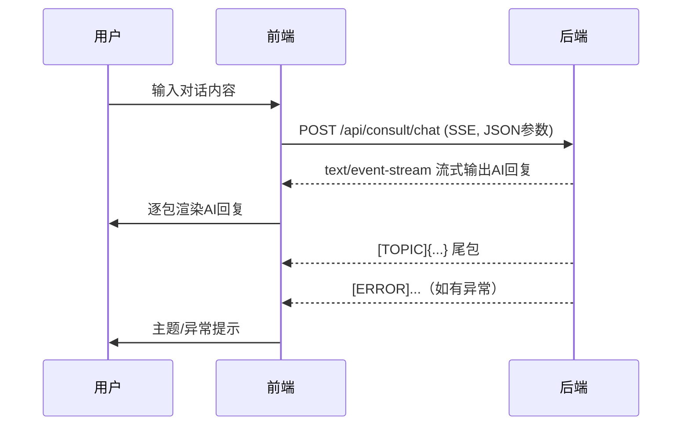

# 根据 openapi 标准构造 consult/chat API 请求 研究报告

## 版本记录

| 日期 | 版本 | 修改内容 | 修改原因 |
|---|---|---|---|
| 2026-01-19 | v1.0 | 初始设计 | 无 |
| 2026-01-19 | v1.1 | 补充 openapi 片段、SSE 细节与前端实现分析 | 细化实现与标准对齐 |
| 2026-01-20 | v1.2 | 明确前端实际请求负载与 openapi 不符，补充风险与开放问题 | 依据实际抓包与用户反馈 |

## 研究问题

根据后端标准（openapi.json），如何在前端正确构造 `api/consult/chat` 这个 API 的请求？

## 发现摘要

- openapi.json 明确规定了 consult/chat 接口的请求方法、路径、参数结构和响应格式。
- 前端应严格按照 openapi.json 的参数定义构造请求体，避免字段遗漏或类型错误。
- 需关注鉴权（如 token）、Content-Type 及异常处理。
- 建议将请求参数类型定义为 TypeScript 类型或 JSDoc 注释，便于维护。

## 相关文件清单

|文件路径|作用说明|关键行号|
|---|---|---|
|openapi.json|后端 API 标准定义|全文件|
|src/api/consult.js|consult 相关 API 封装|全文件|

## 当前实现分析

### openapi.json 相关片段

```json
"/api/consult/chat": {
	"post": {
		"tags": ["consult"],
		"summary": "Consult Chat",
		"requestBody": {
			"content": {
				"application/json": {
					"schema": { "$ref": "#/components/schemas/ChatRequest" }
				}
			},
			"required": true
		},
		"responses": {
			"200": { "description": "Successful Response", "content": { "application/json": { "schema": {} } } },
			"422": { "description": "Validation Error", "content": { "application/json": { "schema": { "$ref": "#/components/schemas/HTTPValidationError" } } } }
		}
	}
}

"ChatRequest": {
	"properties": {
		"query": { "type": "string", "title": "Query" },
		"role": { "type": "string", "title": "Role" },
		"reasoning_effort": { "anyOf": [ { "type": "string" }, { "type": "null" } ], "title": "Reasoning Effort" },
		"session_id": { "anyOf": [ { "type": "integer" }, { "type": "null" } ], "title": "Session Id" }
	},
	"type": "object",
	"required": ["query", "role"],
	"title": "ChatRequest"
}
```

> 说明：openapi.json 并未直接声明 SSE/流式返回，但实际后端实现采用 `text/event-stream`，详见 SSE 输出细节文档。


### consult.js 现有实现

```js
/**
 * chatSSE - 基于 fetch+ReadableStream 的 AI 对话流式接口（POST SSE，对齐 openapi）
 * @param {Object} params - 请求参数，结构需与 openapi 对齐（session_id, query, role, reasoning_effort）
 * @param {function} onMessage - 每段消息回调 (data, {isTopic, isError, isDone})
 * @param {function} onError - 错误回调 (error)
 * @param {function} onComplete - 完成回调 ()
 * @returns {Promise<function>} 返回关闭流的函数
 */
export async function chatSSE(params, { onMessage, onError, onComplete } = {}) {
	const url = `${API_BASE}/chat`;
	let controller = new AbortController();
	let completed = false;
	try {
		const res = await fetch(url, {
			method: 'POST',
			headers: { 'Content-Type': 'application/json' },
			body: JSON.stringify(params),
			credentials: 'include',
			signal: controller.signal,
		});
		if (!res.ok || !res.body) {
			throw new Error('SSE 连接失败');
		}
		const reader = res.body.getReader();
		const decoder = new TextDecoder('utf-8');
		let buffer = '';
		while (true) {
			const { done, value } = await reader.read();
			if (done) break;
			buffer += decoder.decode(value, { stream: true });
			let lines = buffer.split(/\r?\n/);
			buffer = lines.pop();
			for (let line of lines) {
				if (!line.trim()) continue;
				if (line.startsWith('[ERROR]')) {
					if (onError) onError(line.slice(7));
					if (onMessage) onMessage(line.slice(7), { isError: true });
					completed = true;
					if (onComplete) onComplete();
					controller.abort();
					return () => controller.abort();
				}
				if (line.startsWith('[TOPIC]')) {
					if (onMessage) onMessage(line.slice(7), { isTopic: true });
					continue;
				}
				if (line === '[DONE]') {
					completed = true;
					if (onComplete) onComplete();
					controller.abort();
					return () => controller.abort();
				}
				if (onMessage) onMessage(line, {});
			}
		}
		if (!completed && onComplete) onComplete();
	} catch (err) {
		if (!completed && onError) onError(err);
		if (!completed && onComplete) onComplete();
	}
	return () => controller.abort();
}
```

**一致性分析（实际负载问题）**：
- 虽然 consult.js 代码实现支持 openapi.json 所有参数（query, role, session_id, reasoning_effort），但实际前端发出的请求负载（见抓包截图）仅包含 query 字段，缺失 role、reasoning_effort、session_id 字段（即使为 null 也应带上）。
- 这与 openapi.json 的 ChatRequest 要求不符，存在字段缺失问题，可能导致后端校验失败或行为异常。
- 其余流式（SSE）处理、特殊包解析等实现与标准一致。

**参数缺失根因分析**：
- chatSSE API 封装（src/api/consult.js）支持所有 openapi 字段，但调用方（src/pages/consultation/chat.jsx）实际只传递了 { session_id: id, query: content }，未传 role、reasoning_effort 字段。
- role 字段在用户信息（src/store/UserContext.jsx，user.roles）中有获取，但未在 chat 发送参数中用到。
  - 修正： role 字段并非用户类的 roles 字段，而是 str（"user"/"ai"）。在该情境下，一般为 `user`。
- reasoning_effort 字段无 UI 采集，也无默认值逻辑，前端未主动补全。
- InputBar 组件仅采集文本内容，不涉及角色或推理强度等参数。
- 综上，字段缺失原因包括：UI 未采集、调用方未补全、无默认值逻辑、role 来源可追溯但未用。

**关键代码片段与定位**：
- chat 请求参数生成：src/pages/consultation/chat.jsx L55-L80
	```js
	await chatSSE(
		{ session_id: id, query: content },
		{ onMessage, onError, onComplete }
	);
	```
- 用户角色来源：src/store/UserContext.jsx L1-L80，user.roles
- chatSSE API 支持参数：src/api/consult.js L41-L80

**结论**：
- 若需满足 openapi 要求，需在 chat 发送参数时补全 role、reasoning_effort 字段（即使为 null），role 可从 user.roles 获取，reasoning_effort 可设为 null 或由 UI 采集。


### 核心流程



1. 前端组装参数（query, role, session_id, reasoning_effort），严格对齐 openapi.json。
2. 以 POST 方式发起 fetch 请求，Content-Type: application/json。
3. 监听 response.body 流，逐包解析文本。
4. 正常包为 AI 回复文本，特殊包 [TOPIC] 返回主题，异常包 [ERROR] 返回错误。
5. 流结束后，触发 onComplete 回调。


### 关键代码片段

**openapi.json**

```json
"/api/consult/chat": { "post": { ... } }
"ChatRequest": { "properties": { "query": ..., "role": ..., "session_id": ..., "reasoning_effort": ... } }
```

**src/api/consult.js**

```js
export async function chatSSE(params, { onMessage, onError, onComplete } = {}) { /* ...见上文... */ }
```


## 架构洞察

- openapi.json 是参数与接口的唯一标准源，前端需定期校验同步。
- 实际响应为 SSE/流式输出，需结合后端文档与实际接口测试。
- 建议将请求参数类型以 TypeScript/interface 或 JSDoc 注释固化，便于多人协作。
- 可考虑自动化工具校验前后端接口一致性。
- 流式响应需前端特殊处理，不能直接用 res.json()。


## 潜在风险和边缘情况

- openapi.json 变更未及时同步前端实现。
- 字段类型不匹配或缺失导致请求失败或后端行为异常（如 role、session_id、reasoning_effort 未传）。
- 鉴权或 CORS 问题。
- SSE 流式响应未被正确解析，导致消息丢失或异常。
- [TOPIC]、[ERROR] 包未被前端正确处理，影响用户体验。


## 开放问题

- 是否有自动化校验前端 API 实现与 openapi.json 一致性的工具？
- openapi.json 是否可补充对 text/event-stream/SSE 的显式声明？
- chat API SSE 流式包格式是否有变更风险？前端需如何适配？
- [TOPIC]、[ERROR] 包格式是否有更详细约定？
- 前端参数校验与自动补全机制是否完善，能否保证所有必需字段（如 role、session_id、reasoning_effort）即使为 null 也能随请求发送？

## 参考资料

- openapi.json
- src/api/consult.js
- https://swagger.io/specification/
 - docs/tasks/罗问然/07-完善chat页面AI对话/SSE 输出细节.md
